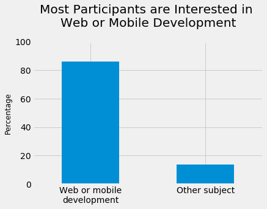
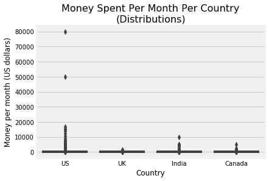
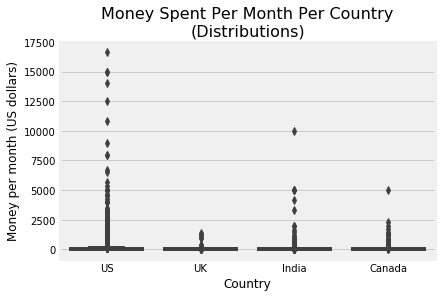
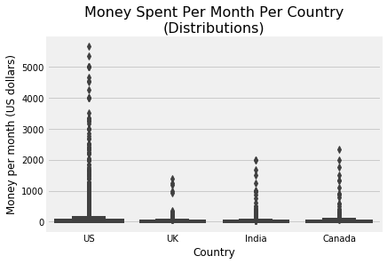

# Finding the Two Best Markets to Advertise in an E-learning Product
In this project, we'll aim to find the two best markets to advertise our product in — we're working for an e-learning company that offers courses on programming. Most of our courses are on web and mobile development, but we also cover many other domains, like data science, game development, etc.

# Understanding the Data¶
To avoid spending money on organizing a survey, we'll first try to make use of existing data to determine whether we can reach any reliable result.

One good candidate for our purpose is __[freeCodeCamp's 2017 New Coder Survey](https://medium.freecodecamp.org/we-asked-20-000-people-who-they-are-and-how-theyre-learning-to-code-fff5d668969)__. __[freeCodeCamp](https://www.freecodecamp.org/)__ is a free e-learning platform that offers courses on web development. Because they run a __[popular Medium publication](https://medium.freecodecamp.org/)__ (over 400,000 followers), their survey attracted new coders with varying interests (not only web development), which is ideal for the purpose of our analysis.

The survey data is publicly available in this __[GitHub repository](https://github.com/freeCodeCamp/2017-new-coder-survey)__. Below, we'll do a quick exploration of the 2017-fCC-New-Coders-Survey-Data.csv file stored in the clean-data folder of the repository we just mentioned. We'll read in the file using the direct link __[here](https://raw.githubusercontent.com/freeCodeCamp/2017-new-coder-survey/master/clean-data/2017-fCC-New-Coders-Survey-Data.csv)__.


```python
# Read in the data
import pandas as pd
direct_link = 'https://raw.githubusercontent.com/freeCodeCamp/2017-new-coder-survey/master/clean-data/2017-fCC-New-Coders-Survey-Data.csv'
fcc = pd.read_csv(direct_link, low_memory = 0) # low_memory = False to silence dtypes warning

# Quick exploration of the data
print(fcc.shape)
pd.options.display.max_columns = 150 # to avoid truncated output 
fcc.head()
```

    (18175, 136)


<div>
<style scoped>
    .dataframe tbody tr th:only-of-type {
        vertical-align: middle;
    }

    .dataframe tbody tr th {
        vertical-align: top;
    }

    .dataframe thead th {
        text-align: right;
    }
</style>
<table border="1" class="dataframe">
  <thead>
    <tr style="text-align: right;">
      <th></th>
      <th>Age</th>
      <th>AttendedBootcamp</th>
      <th>BootcampFinish</th>
      <th>BootcampLoanYesNo</th>
      <th>BootcampName</th>
      <th>BootcampRecommend</th>
      <th>ChildrenNumber</th>
      <th>CityPopulation</th>
      <th>CodeEventConferences</th>
      <th>CodeEventDjangoGirls</th>
      <th>CodeEventFCC</th>
      <th>CodeEventGameJam</th>
      <th>CodeEventGirlDev</th>
      <th>CodeEventHackathons</th>
      <th>CodeEventMeetup</th>
      <th>CodeEventNodeSchool</th>
      <th>CodeEventNone</th>
      <th>CodeEventOther</th>
      <th>CodeEventRailsBridge</th>
      <th>CodeEventRailsGirls</th>
      <th>CodeEventStartUpWknd</th>
      <th>CodeEventWkdBootcamps</th>
      <th>CodeEventWomenCode</th>
      <th>CodeEventWorkshops</th>
      <th>CommuteTime</th>
      <th>CountryCitizen</th>
      <th>CountryLive</th>
      <th>EmploymentField</th>
      <th>EmploymentFieldOther</th>
      <th>EmploymentStatus</th>
      <th>EmploymentStatusOther</th>
      <th>ExpectedEarning</th>
      <th>FinanciallySupporting</th>
      <th>FirstDevJob</th>
      <th>Gender</th>
      <th>GenderOther</th>
      <th>HasChildren</th>
      <th>HasDebt</th>
      <th>HasFinancialDependents</th>
      <th>HasHighSpdInternet</th>
      <th>HasHomeMortgage</th>
      <th>HasServedInMilitary</th>
      <th>HasStudentDebt</th>
      <th>HomeMortgageOwe</th>
      <th>HoursLearning</th>
      <th>ID.x</th>
      <th>ID.y</th>
      <th>Income</th>
      <th>IsEthnicMinority</th>
      <th>IsReceiveDisabilitiesBenefits</th>
      <th>IsSoftwareDev</th>
      <th>IsUnderEmployed</th>
      <th>JobApplyWhen</th>
      <th>JobInterestBackEnd</th>
      <th>JobInterestDataEngr</th>
      <th>JobInterestDataSci</th>
      <th>JobInterestDevOps</th>
      <th>JobInterestFrontEnd</th>
      <th>JobInterestFullStack</th>
      <th>JobInterestGameDev</th>
      <th>JobInterestInfoSec</th>
      <th>JobInterestMobile</th>
      <th>JobInterestOther</th>
      <th>JobInterestProjMngr</th>
      <th>JobInterestQAEngr</th>
      <th>JobInterestUX</th>
      <th>JobPref</th>
      <th>JobRelocateYesNo</th>
      <th>JobRoleInterest</th>
      <th>JobWherePref</th>
      <th>LanguageAtHome</th>
      <th>MaritalStatus</th>
      <th>MoneyForLearning</th>
      <th>MonthsProgramming</th>
      <th>NetworkID</th>
      <th>Part1EndTime</th>
      <th>Part1StartTime</th>
      <th>Part2EndTime</th>
      <th>Part2StartTime</th>
      <th>PodcastChangeLog</th>
      <th>PodcastCodeNewbie</th>
      <th>PodcastCodePen</th>
      <th>PodcastDevTea</th>
      <th>PodcastDotNET</th>
      <th>PodcastGiantRobots</th>
      <th>PodcastJSAir</th>
      <th>PodcastJSJabber</th>
      <th>PodcastNone</th>
      <th>PodcastOther</th>
      <th>PodcastProgThrowdown</th>
      <th>PodcastRubyRogues</th>
      <th>PodcastSEDaily</th>
      <th>PodcastSERadio</th>
      <th>PodcastShopTalk</th>
      <th>PodcastTalkPython</th>
      <th>PodcastTheWebAhead</th>
      <th>ResourceCodecademy</th>
      <th>ResourceCodeWars</th>
      <th>ResourceCoursera</th>
      <th>ResourceCSS</th>
      <th>ResourceEdX</th>
      <th>ResourceEgghead</th>
      <th>ResourceFCC</th>
      <th>ResourceHackerRank</th>
      <th>ResourceKA</th>
      <th>ResourceLynda</th>
      <th>ResourceMDN</th>
      <th>ResourceOdinProj</th>
      <th>ResourceOther</th>
      <th>ResourcePluralSight</th>
      <th>ResourceSkillcrush</th>
      <th>ResourceSO</th>
      <th>ResourceTreehouse</th>
      <th>ResourceUdacity</th>
      <th>ResourceUdemy</th>
      <th>ResourceW3S</th>
      <th>SchoolDegree</th>
      <th>SchoolMajor</th>
      <th>StudentDebtOwe</th>
      <th>YouTubeCodeCourse</th>
      <th>YouTubeCodingTrain</th>
      <th>YouTubeCodingTut360</th>
      <th>YouTubeComputerphile</th>
      <th>YouTubeDerekBanas</th>
      <th>YouTubeDevTips</th>
      <th>YouTubeEngineeredTruth</th>
      <th>YouTubeFCC</th>
      <th>YouTubeFunFunFunction</th>
      <th>YouTubeGoogleDev</th>
      <th>YouTubeLearnCode</th>
      <th>YouTubeLevelUpTuts</th>
      <th>YouTubeMIT</th>
      <th>YouTubeMozillaHacks</th>
      <th>YouTubeOther</th>
      <th>YouTubeSimplilearn</th>
      <th>YouTubeTheNewBoston</th>
    </tr>
  </thead>
  <tbody>
    <tr>
      <th>0</th>
      <td>27.0</td>
      <td>0.0</td>
      <td>NaN</td>
      <td>NaN</td>
      <td>NaN</td>
      <td>NaN</td>
      <td>NaN</td>
      <td>more than 1 million</td>
      <td>NaN</td>
      <td>NaN</td>
      <td>NaN</td>
      <td>NaN</td>
      <td>NaN</td>
      <td>NaN</td>
      <td>NaN</td>
      <td>NaN</td>
      <td>NaN</td>
      <td>NaN</td>
      <td>NaN</td>
      <td>NaN</td>
      <td>NaN</td>
      <td>NaN</td>
      <td>NaN</td>
      <td>NaN</td>
      <td>15 to 29 minutes</td>
      <td>Canada</td>
      <td>Canada</td>
      <td>software development and IT</td>
      <td>NaN</td>
      <td>Employed for wages</td>
      <td>NaN</td>
      <td>NaN</td>
      <td>NaN</td>
      <td>NaN</td>
      <td>female</td>
      <td>NaN</td>
      <td>NaN</td>
      <td>1.0</td>
      <td>0.0</td>
      <td>1.0</td>
      <td>0.0</td>
      <td>0.0</td>
      <td>0.0</td>
      <td>NaN</td>
      <td>15.0</td>
      <td>02d9465b21e8bd09374b0066fb2d5614</td>
      <td>eb78c1c3ac6cd9052aec557065070fbf</td>
      <td>NaN</td>
      <td>NaN</td>
      <td>0.0</td>
      <td>0.0</td>
      <td>0.0</td>
      <td>NaN</td>
      <td>NaN</td>
      <td>NaN</td>
      <td>NaN</td>
      <td>NaN</td>
      <td>NaN</td>
      <td>NaN</td>
      <td>NaN</td>
      <td>NaN</td>
      <td>NaN</td>
      <td>NaN</td>
      <td>NaN</td>
      <td>NaN</td>
      <td>NaN</td>
      <td>start your own business</td>
      <td>NaN</td>
      <td>NaN</td>
      <td>NaN</td>
      <td>English</td>
      <td>married or domestic partnership</td>
      <td>150.0</td>
      <td>6.0</td>
      <td>6f1fbc6b2b</td>
      <td>2017-03-09 00:36:22</td>
      <td>2017-03-09 00:32:59</td>
      <td>2017-03-09 00:59:46</td>
      <td>2017-03-09 00:36:26</td>
      <td>NaN</td>
      <td>NaN</td>
      <td>NaN</td>
      <td>1.0</td>
      <td>NaN</td>
      <td>NaN</td>
      <td>NaN</td>
      <td>NaN</td>
      <td>NaN</td>
      <td>NaN</td>
      <td>NaN</td>
      <td>NaN</td>
      <td>NaN</td>
      <td>NaN</td>
      <td>NaN</td>
      <td>NaN</td>
      <td>NaN</td>
      <td>1.0</td>
      <td>NaN</td>
      <td>NaN</td>
      <td>NaN</td>
      <td>NaN</td>
      <td>NaN</td>
      <td>1.0</td>
      <td>NaN</td>
      <td>NaN</td>
      <td>NaN</td>
      <td>1.0</td>
      <td>NaN</td>
      <td>NaN</td>
      <td>NaN</td>
      <td>NaN</td>
      <td>NaN</td>
      <td>NaN</td>
      <td>NaN</td>
      <td>1.0</td>
      <td>1.0</td>
      <td>some college credit, no degree</td>
      <td>NaN</td>
      <td>NaN</td>
      <td>NaN</td>
      <td>NaN</td>
      <td>NaN</td>
      <td>NaN</td>
      <td>NaN</td>
      <td>NaN</td>
      <td>NaN</td>
      <td>NaN</td>
      <td>NaN</td>
      <td>NaN</td>
      <td>NaN</td>
      <td>NaN</td>
      <td>NaN</td>
      <td>NaN</td>
      <td>NaN</td>
      <td>NaN</td>
      <td>NaN</td>
    </tr>
    <tr>
      <th>1</th>
      <td>34.0</td>
      <td>0.0</td>
      <td>NaN</td>
      <td>NaN</td>
      <td>NaN</td>
      <td>NaN</td>
      <td>NaN</td>
      <td>less than 100,000</td>
      <td>NaN</td>
      <td>NaN</td>
      <td>NaN</td>
      <td>NaN</td>
      <td>NaN</td>
      <td>NaN</td>
      <td>NaN</td>
      <td>NaN</td>
      <td>NaN</td>
      <td>NaN</td>
      <td>NaN</td>
      <td>NaN</td>
      <td>NaN</td>
      <td>NaN</td>
      <td>NaN</td>
      <td>NaN</td>
      <td>NaN</td>
      <td>United States of America</td>
      <td>United States of America</td>
      <td>NaN</td>
      <td>NaN</td>
      <td>Not working but looking for work</td>
      <td>NaN</td>
      <td>35000.0</td>
      <td>NaN</td>
      <td>NaN</td>
      <td>male</td>
      <td>NaN</td>
      <td>NaN</td>
      <td>1.0</td>
      <td>0.0</td>
      <td>1.0</td>
      <td>0.0</td>
      <td>0.0</td>
      <td>1.0</td>
      <td>NaN</td>
      <td>10.0</td>
      <td>5bfef9ecb211ec4f518cfc1d2a6f3e0c</td>
      <td>21db37adb60cdcafadfa7dca1b13b6b1</td>
      <td>NaN</td>
      <td>0.0</td>
      <td>0.0</td>
      <td>0.0</td>
      <td>NaN</td>
      <td>Within 7 to 12 months</td>
      <td>NaN</td>
      <td>NaN</td>
      <td>NaN</td>
      <td>NaN</td>
      <td>NaN</td>
      <td>1.0</td>
      <td>NaN</td>
      <td>NaN</td>
      <td>NaN</td>
      <td>NaN</td>
      <td>NaN</td>
      <td>NaN</td>
      <td>NaN</td>
      <td>work for a nonprofit</td>
      <td>1.0</td>
      <td>Full-Stack Web Developer</td>
      <td>in an office with other developers</td>
      <td>English</td>
      <td>single, never married</td>
      <td>80.0</td>
      <td>6.0</td>
      <td>f8f8be6910</td>
      <td>2017-03-09 00:37:07</td>
      <td>2017-03-09 00:33:26</td>
      <td>2017-03-09 00:38:59</td>
      <td>2017-03-09 00:37:10</td>
      <td>NaN</td>
      <td>1.0</td>
      <td>NaN</td>
      <td>NaN</td>
      <td>NaN</td>
      <td>NaN</td>
      <td>NaN</td>
      <td>NaN</td>
      <td>NaN</td>
      <td>NaN</td>
      <td>NaN</td>
      <td>NaN</td>
      <td>NaN</td>
      <td>NaN</td>
      <td>NaN</td>
      <td>NaN</td>
      <td>NaN</td>
      <td>1.0</td>
      <td>NaN</td>
      <td>NaN</td>
      <td>1.0</td>
      <td>NaN</td>
      <td>NaN</td>
      <td>1.0</td>
      <td>NaN</td>
      <td>NaN</td>
      <td>NaN</td>
      <td>NaN</td>
      <td>NaN</td>
      <td>NaN</td>
      <td>NaN</td>
      <td>NaN</td>
      <td>1.0</td>
      <td>NaN</td>
      <td>NaN</td>
      <td>1.0</td>
      <td>1.0</td>
      <td>some college credit, no degree</td>
      <td>NaN</td>
      <td>NaN</td>
      <td>NaN</td>
      <td>NaN</td>
      <td>NaN</td>
      <td>NaN</td>
      <td>NaN</td>
      <td>NaN</td>
      <td>NaN</td>
      <td>1.0</td>
      <td>NaN</td>
      <td>NaN</td>
      <td>NaN</td>
      <td>NaN</td>
      <td>NaN</td>
      <td>NaN</td>
      <td>NaN</td>
      <td>NaN</td>
      <td>NaN</td>
    </tr>
    <tr>
      <th>2</th>
      <td>21.0</td>
      <td>0.0</td>
      <td>NaN</td>
      <td>NaN</td>
      <td>NaN</td>
      <td>NaN</td>
      <td>NaN</td>
      <td>more than 1 million</td>
      <td>NaN</td>
      <td>NaN</td>
      <td>NaN</td>
      <td>NaN</td>
      <td>NaN</td>
      <td>1.0</td>
      <td>NaN</td>
      <td>1.0</td>
      <td>NaN</td>
      <td>NaN</td>
      <td>NaN</td>
      <td>NaN</td>
      <td>NaN</td>
      <td>NaN</td>
      <td>NaN</td>
      <td>NaN</td>
      <td>15 to 29 minutes</td>
      <td>United States of America</td>
      <td>United States of America</td>
      <td>software development and IT</td>
      <td>NaN</td>
      <td>Employed for wages</td>
      <td>NaN</td>
      <td>70000.0</td>
      <td>NaN</td>
      <td>NaN</td>
      <td>male</td>
      <td>NaN</td>
      <td>NaN</td>
      <td>0.0</td>
      <td>0.0</td>
      <td>1.0</td>
      <td>NaN</td>
      <td>0.0</td>
      <td>NaN</td>
      <td>NaN</td>
      <td>25.0</td>
      <td>14f1863afa9c7de488050b82eb3edd96</td>
      <td>21ba173828fbe9e27ccebaf4d5166a55</td>
      <td>13000.0</td>
      <td>1.0</td>
      <td>0.0</td>
      <td>0.0</td>
      <td>0.0</td>
      <td>Within 7 to 12 months</td>
      <td>1.0</td>
      <td>NaN</td>
      <td>NaN</td>
      <td>1.0</td>
      <td>1.0</td>
      <td>1.0</td>
      <td>NaN</td>
      <td>NaN</td>
      <td>1.0</td>
      <td>NaN</td>
      <td>NaN</td>
      <td>NaN</td>
      <td>NaN</td>
      <td>work for a medium-sized company</td>
      <td>1.0</td>
      <td>Front-End Web Developer, Back-End Web Develo...</td>
      <td>no preference</td>
      <td>Spanish</td>
      <td>single, never married</td>
      <td>1000.0</td>
      <td>5.0</td>
      <td>2ed189768e</td>
      <td>2017-03-09 00:37:58</td>
      <td>2017-03-09 00:33:53</td>
      <td>2017-03-09 00:40:14</td>
      <td>2017-03-09 00:38:02</td>
      <td>1.0</td>
      <td>NaN</td>
      <td>1.0</td>
      <td>NaN</td>
      <td>NaN</td>
      <td>NaN</td>
      <td>NaN</td>
      <td>NaN</td>
      <td>NaN</td>
      <td>Codenewbie</td>
      <td>NaN</td>
      <td>NaN</td>
      <td>NaN</td>
      <td>NaN</td>
      <td>1.0</td>
      <td>NaN</td>
      <td>NaN</td>
      <td>1.0</td>
      <td>NaN</td>
      <td>NaN</td>
      <td>1.0</td>
      <td>NaN</td>
      <td>NaN</td>
      <td>1.0</td>
      <td>NaN</td>
      <td>NaN</td>
      <td>NaN</td>
      <td>1.0</td>
      <td>NaN</td>
      <td>NaN</td>
      <td>NaN</td>
      <td>NaN</td>
      <td>NaN</td>
      <td>NaN</td>
      <td>1.0</td>
      <td>1.0</td>
      <td>NaN</td>
      <td>high school diploma or equivalent (GED)</td>
      <td>NaN</td>
      <td>NaN</td>
      <td>NaN</td>
      <td>NaN</td>
      <td>1.0</td>
      <td>NaN</td>
      <td>1.0</td>
      <td>1.0</td>
      <td>NaN</td>
      <td>NaN</td>
      <td>NaN</td>
      <td>NaN</td>
      <td>1.0</td>
      <td>1.0</td>
      <td>NaN</td>
      <td>NaN</td>
      <td>NaN</td>
      <td>NaN</td>
      <td>NaN</td>
    </tr>
    <tr>
      <th>3</th>
      <td>26.0</td>
      <td>0.0</td>
      <td>NaN</td>
      <td>NaN</td>
      <td>NaN</td>
      <td>NaN</td>
      <td>NaN</td>
      <td>between 100,000 and 1 million</td>
      <td>NaN</td>
      <td>NaN</td>
      <td>NaN</td>
      <td>NaN</td>
      <td>NaN</td>
      <td>NaN</td>
      <td>NaN</td>
      <td>NaN</td>
      <td>NaN</td>
      <td>NaN</td>
      <td>NaN</td>
      <td>NaN</td>
      <td>NaN</td>
      <td>NaN</td>
      <td>NaN</td>
      <td>NaN</td>
      <td>I work from home</td>
      <td>Brazil</td>
      <td>Brazil</td>
      <td>software development and IT</td>
      <td>NaN</td>
      <td>Employed for wages</td>
      <td>NaN</td>
      <td>40000.0</td>
      <td>0.0</td>
      <td>NaN</td>
      <td>male</td>
      <td>NaN</td>
      <td>0.0</td>
      <td>1.0</td>
      <td>1.0</td>
      <td>1.0</td>
      <td>1.0</td>
      <td>0.0</td>
      <td>0.0</td>
      <td>40000.0</td>
      <td>14.0</td>
      <td>91756eb4dc280062a541c25a3d44cfb0</td>
      <td>3be37b558f02daae93a6da10f83f0c77</td>
      <td>24000.0</td>
      <td>0.0</td>
      <td>0.0</td>
      <td>0.0</td>
      <td>1.0</td>
      <td>Within the next 6 months</td>
      <td>1.0</td>
      <td>NaN</td>
      <td>NaN</td>
      <td>NaN</td>
      <td>1.0</td>
      <td>1.0</td>
      <td>NaN</td>
      <td>NaN</td>
      <td>NaN</td>
      <td>NaN</td>
      <td>NaN</td>
      <td>NaN</td>
      <td>NaN</td>
      <td>work for a medium-sized company</td>
      <td>NaN</td>
      <td>Front-End Web Developer, Full-Stack Web Deve...</td>
      <td>from home</td>
      <td>Portuguese</td>
      <td>married or domestic partnership</td>
      <td>0.0</td>
      <td>5.0</td>
      <td>dbdc0664d1</td>
      <td>2017-03-09 00:40:13</td>
      <td>2017-03-09 00:37:45</td>
      <td>2017-03-09 00:42:26</td>
      <td>2017-03-09 00:40:18</td>
      <td>NaN</td>
      <td>NaN</td>
      <td>NaN</td>
      <td>NaN</td>
      <td>NaN</td>
      <td>NaN</td>
      <td>NaN</td>
      <td>NaN</td>
      <td>NaN</td>
      <td>NaN</td>
      <td>NaN</td>
      <td>NaN</td>
      <td>NaN</td>
      <td>NaN</td>
      <td>NaN</td>
      <td>NaN</td>
      <td>NaN</td>
      <td>NaN</td>
      <td>NaN</td>
      <td>NaN</td>
      <td>NaN</td>
      <td>NaN</td>
      <td>1.0</td>
      <td>1.0</td>
      <td>NaN</td>
      <td>NaN</td>
      <td>NaN</td>
      <td>1.0</td>
      <td>NaN</td>
      <td>NaN</td>
      <td>NaN</td>
      <td>NaN</td>
      <td>1.0</td>
      <td>NaN</td>
      <td>NaN</td>
      <td>NaN</td>
      <td>NaN</td>
      <td>some college credit, no degree</td>
      <td>NaN</td>
      <td>NaN</td>
      <td>NaN</td>
      <td>NaN</td>
      <td>NaN</td>
      <td>NaN</td>
      <td>NaN</td>
      <td>1.0</td>
      <td>NaN</td>
      <td>1.0</td>
      <td>1.0</td>
      <td>NaN</td>
      <td>NaN</td>
      <td>1.0</td>
      <td>NaN</td>
      <td>NaN</td>
      <td>NaN</td>
      <td>NaN</td>
      <td>NaN</td>
    </tr>
    <tr>
      <th>4</th>
      <td>20.0</td>
      <td>0.0</td>
      <td>NaN</td>
      <td>NaN</td>
      <td>NaN</td>
      <td>NaN</td>
      <td>NaN</td>
      <td>between 100,000 and 1 million</td>
      <td>NaN</td>
      <td>NaN</td>
      <td>NaN</td>
      <td>NaN</td>
      <td>NaN</td>
      <td>NaN</td>
      <td>NaN</td>
      <td>NaN</td>
      <td>NaN</td>
      <td>NaN</td>
      <td>NaN</td>
      <td>NaN</td>
      <td>NaN</td>
      <td>NaN</td>
      <td>NaN</td>
      <td>NaN</td>
      <td>NaN</td>
      <td>Portugal</td>
      <td>Portugal</td>
      <td>NaN</td>
      <td>NaN</td>
      <td>Not working but looking for work</td>
      <td>NaN</td>
      <td>140000.0</td>
      <td>NaN</td>
      <td>NaN</td>
      <td>female</td>
      <td>NaN</td>
      <td>NaN</td>
      <td>0.0</td>
      <td>0.0</td>
      <td>1.0</td>
      <td>NaN</td>
      <td>0.0</td>
      <td>NaN</td>
      <td>NaN</td>
      <td>10.0</td>
      <td>aa3f061a1949a90b27bef7411ecd193f</td>
      <td>d7c56bbf2c7b62096be9db010e86d96d</td>
      <td>NaN</td>
      <td>0.0</td>
      <td>0.0</td>
      <td>0.0</td>
      <td>NaN</td>
      <td>Within 7 to 12 months</td>
      <td>1.0</td>
      <td>NaN</td>
      <td>NaN</td>
      <td>NaN</td>
      <td>1.0</td>
      <td>1.0</td>
      <td>NaN</td>
      <td>1.0</td>
      <td>1.0</td>
      <td>NaN</td>
      <td>NaN</td>
      <td>NaN</td>
      <td>NaN</td>
      <td>work for a multinational corporation</td>
      <td>1.0</td>
      <td>Full-Stack Web Developer, Information Security...</td>
      <td>in an office with other developers</td>
      <td>Portuguese</td>
      <td>single, never married</td>
      <td>0.0</td>
      <td>24.0</td>
      <td>11b0f2d8a9</td>
      <td>2017-03-09 00:42:45</td>
      <td>2017-03-09 00:39:44</td>
      <td>2017-03-09 00:45:42</td>
      <td>2017-03-09 00:42:50</td>
      <td>NaN</td>
      <td>NaN</td>
      <td>NaN</td>
      <td>NaN</td>
      <td>NaN</td>
      <td>NaN</td>
      <td>NaN</td>
      <td>NaN</td>
      <td>NaN</td>
      <td>NaN</td>
      <td>NaN</td>
      <td>NaN</td>
      <td>NaN</td>
      <td>NaN</td>
      <td>NaN</td>
      <td>NaN</td>
      <td>NaN</td>
      <td>NaN</td>
      <td>NaN</td>
      <td>NaN</td>
      <td>NaN</td>
      <td>NaN</td>
      <td>NaN</td>
      <td>NaN</td>
      <td>NaN</td>
      <td>NaN</td>
      <td>NaN</td>
      <td>NaN</td>
      <td>NaN</td>
      <td>NaN</td>
      <td>NaN</td>
      <td>NaN</td>
      <td>1.0</td>
      <td>NaN</td>
      <td>NaN</td>
      <td>NaN</td>
      <td>NaN</td>
      <td>bachelor's degree</td>
      <td>Information Technology</td>
      <td>NaN</td>
      <td>NaN</td>
      <td>NaN</td>
      <td>NaN</td>
      <td>NaN</td>
      <td>NaN</td>
      <td>NaN</td>
      <td>NaN</td>
      <td>NaN</td>
      <td>NaN</td>
      <td>NaN</td>
      <td>NaN</td>
      <td>NaN</td>
      <td>NaN</td>
      <td>NaN</td>
      <td>NaN</td>
      <td>NaN</td>
      <td>NaN</td>
    </tr>
  </tbody>
</table>
</div>


# Checking for Sample Representativity
As we mentioned in the introduction, most of our courses are on web and mobile development, but we also cover many other domains, like data science, game development, etc. For the purpose of our analysis, we want to answer questions about a population of new coders that are interested in the subjects we teach. We'd like to know:

 - Where are these new coders located.
 - What locations have the greatest densities of new coders.
 - How much money they're willing to spend on learning.
 
So we first need to clarify whether the data set has the right categories of people for our purpose. The JobRoleInterest column describes for every participant the role(s) they'd be interested in working in. If a participant is interested in working in a certain domain, it means that they're also interested in learning about that domain. So let's take a look at the frequency distribution table of this column and determine whether the data we have is relevant.


```python
# Frequency distribution table for 'JobRoleInterest'
fcc['JobRoleInterest'].value_counts(normalize = True) * 100
```


    Full-Stack Web Developer                                                                                                                                                                          11.770595
      Front-End Web Developer                                                                                                                                                                          6.435927
      Data Scientist                                                                                                                                                                                   2.173913
    Back-End Web Developer                                                                                                                                                                             2.030892
      Mobile Developer                                                                                                                                                                                 1.673341
    Game Developer                                                                                                                                                                                     1.630435
    Information Security                                                                                                                                                                               1.315789
    Full-Stack Web Developer,   Front-End Web Developer                                                                                                                                                0.915332
      Front-End Web Developer, Full-Stack Web Developer                                                                                                                                                0.800915
      Product Manager                                                                                                                                                                                  0.786613
    Data Engineer                                                                                                                                                                                      0.758009
      User Experience Designer                                                                                                                                                                         0.743707
      User Experience Designer,   Front-End Web Developer                                                                                                                                              0.614989
      Front-End Web Developer, Back-End Web Developer, Full-Stack Web Developer                                                                                                                        0.557780
      DevOps / SysAdmin                                                                                                                                                                                0.514874
    Back-End Web Developer, Full-Stack Web Developer,   Front-End Web Developer                                                                                                                        0.514874
    Back-End Web Developer,   Front-End Web Developer, Full-Stack Web Developer                                                                                                                        0.514874
    Full-Stack Web Developer,   Front-End Web Developer, Back-End Web Developer                                                                                                                        0.443364
      Front-End Web Developer, Full-Stack Web Developer, Back-End Web Developer                                                                                                                        0.429062
    Full-Stack Web Developer,   Mobile Developer                                                                                                                                                       0.414760
      Front-End Web Developer,   User Experience Designer                                                                                                                                              0.414760
    Back-End Web Developer, Full-Stack Web Developer                                                                                                                                                   0.386156
    Full-Stack Web Developer, Back-End Web Developer                                                                                                                                                   0.371854
    Back-End Web Developer,   Front-End Web Developer                                                                                                                                                  0.286041
    Full-Stack Web Developer, Back-End Web Developer,   Front-End Web Developer                                                                                                                        0.271739
    Data Engineer,   Data Scientist                                                                                                                                                                    0.271739
      Front-End Web Developer,   Mobile Developer                                                                                                                                                      0.257437
    Full-Stack Web Developer,   Data Scientist                                                                                                                                                         0.243135
      Mobile Developer, Game Developer                                                                                                                                                                 0.228833
      Data Scientist, Data Engineer                                                                                                                                                                    0.228833
                                                                                                                                                                                                        ...    
      Front-End Web Developer, Full-Stack Web Developer,   Mobile Developer, Back-End Web Developer,   Quality Assurance Engineer, Information Security, Game Developer, Data Engineer                 0.014302
    Back-End Web Developer, Game Developer,   Front-End Web Developer                                                                                                                                  0.014302
    Back-End Web Developer,   Mobile Developer, Full-Stack Web Developer,   DevOps / SysAdmin,   Front-End Web Developer, Data Engineer,   Product Manager                                             0.014302
    Full-Stack Web Developer,   Product Manager, Back-End Web Developer, Information Security,   User Experience Designer,   Mobile Developer,   Front-End Web Developer                               0.014302
    Game Developer,   Mobile Developer, Data Engineer, Back-End Web Developer,   Data Scientist,   Front-End Web Developer, Full-Stack Web Developer, Information Security                             0.014302
      Data Scientist, Full-Stack Web Developer, Back-End Web Developer, Data Engineer,   Mobile Developer                                                                                              0.014302
      Mobile Developer, Game Developer, Full-Stack Web Developer,   User Experience Designer                                                                                                           0.014302
    Back-End Web Developer, Information Security,   Front-End Web Developer,   DevOps / SysAdmin, Game Developer                                                                                       0.014302
    Information Security, Full-Stack Web Developer,   Front-End Web Developer, Data Engineer,   DevOps / SysAdmin                                                                                      0.014302
    Back-End Web Developer, Full-Stack Web Developer,   Mobile Developer,   Front-End Web Developer,   User Experience Designer, Game Developer, Information Security                                  0.014302
    I don't know yet!                                                                                                                                                                                  0.014302
    Full-Stack Web Developer,   Quality Assurance Engineer,   Mobile Developer, Back-End Web Developer                                                                                                 0.014302
      Product Manager,   Mobile Developer, Game Developer, Back-End Web Developer                                                                                                                      0.014302
      Front-End Web Developer,   User Experience Designer,   Mobile Developer, Game Developer, Information Security, Full-Stack Web Developer, Back-End Web Developer                                  0.014302
      DevOps / SysAdmin,   Mobile Developer,   Front-End Web Developer, Back-End Web Developer                                                                                                         0.014302
    Information Security,   Mobile Developer,   Front-End Web Developer,   User Experience Designer, Full-Stack Web Developer                                                                          0.014302
    Data Engineer, Information Security,   DevOps / SysAdmin,   Data Scientist,   Front-End Web Developer, Full-Stack Web Developer                                                                    0.014302
    Full-Stack Web Developer,   Quality Assurance Engineer, Game Developer, Back-End Web Developer,   User Experience Designer,   Front-End Web Developer                                              0.014302
      Mobile Developer, Game Developer,   Front-End Web Developer, Back-End Web Developer,   User Experience Designer, Full-Stack Web Developer,   Quality Assurance Engineer,   DevOps / SysAdmin     0.014302
    Back-End Web Developer, Full-Stack Web Developer,   Mobile Developer, Game Developer                                                                                                               0.014302
      Mobile Developer, Full-Stack Web Developer,   User Experience Designer,   Front-End Web Developer, Back-End Web Developer, Information Security,   Product Manager                               0.014302
    Back-End Web Developer, Data Engineer,   Data Scientist,   Quality Assurance Engineer, Information Security, Full-Stack Web Developer                                                              0.014302
    Full-Stack Web Developer,   Front-End Web Developer,   DevOps / SysAdmin, Data Engineer, Back-End Web Developer,   Quality Assurance Engineer                                                      0.014302
      Front-End Web Developer, Information Security,   Mobile Developer, Full-Stack Web Developer, Back-End Web Developer                                                                              0.014302
      Front-End Web Developer, Full-Stack Web Developer, Back-End Web Developer,   Mobile Developer,   Product Manager,   User Experience Designer,   Data Scientist                                   0.014302
      Front-End Web Developer,   Data Scientist, Information Security, Full-Stack Web Developer, Back-End Web Developer,   Mobile Developer, Data Engineer                                             0.014302
    Full-Stack Web Developer,   DevOps / SysAdmin,   Data Scientist,   Front-End Web Developer,   User Experience Designer                                                                             0.014302
    Full-Stack Web Developer,   User Experience Designer,   Data Scientist,   Quality Assurance Engineer                                                                                               0.014302
      Product Manager, Information Security,   Data Scientist                                                                                                                                          0.014302
    Systems Programmer                                                                                                                                                                                 0.014302
    Name: JobRoleInterest, Length: 3213, dtype: float64


The information in the table above is quite granular, but from a quick scan it looks like:

 - A lot of people are interested in web development (full-stack web development, front-end web development and back-end web development).
 - A few people are interested in mobile development.
 - A few people are interested in domains other than web and mobile development.
 
It's also interesting to note that many respondents are interested in more than one subject. It'd be useful to get a better picture of how many people are interested in a single subject and how many have mixed interests. Consequently, in the next code block, we'll:

 - Split each string in the JobRoleInterest column to find the number of options for each participant.
     - We'll first drop the null values because we can't split Nan values.
     
Generate a frequency table for the variable describing the number of options.


```python
# Split each string in the 'JobRoleInterest' column
interests_no_nulls = fcc['JobRoleInterest'].dropna()
splitted_interests = interests_no_nulls.str.split(',')

# Frequency table for the var describing the number of options
n_of_options = splitted_interests.apply(lambda x: len(x)) # x is a list of job options
n_of_options.value_counts(normalize = True).sort_index() * 100
```


    1     31.650458
    2     10.883867
    3     15.889588
    4     15.217391
    5     12.042334
    6      6.721968
    7      3.861556
    8      1.759153
    9      0.986842
    10     0.471968
    11     0.185927
    12     0.300343
    13     0.028604
    Name: JobRoleInterest, dtype: float64


It turns out that only 31.7% of the participants have a clear idea about what programming niche they'd like to work in, while the vast majority of students have mixed interests. But given that we offer courses on various subjects, the fact that new coders have mixed interest might be actually good for us.

The focus of our courses is on web and mobile development, so let's find out how many respondents chose at least one of these two options.


```python
# Frequency table
web_or_mobile = interests_no_nulls.str.contains(
    'Web Developer|Mobile Developer') # returns an array of booleans
freq_table = web_or_mobile.value_counts(normalize = True) * 100
print(freq_table)

# Graph for the frequency table above
%matplotlib inline
import matplotlib.pyplot as plt
plt.style.use('fivethirtyeight')

freq_table.plot.bar()
plt.title('Most Participants are Interested in \nWeb or Mobile Development',
          y = 1.08) # y pads the title upward
plt.ylabel('Percentage', fontsize = 12)
plt.xticks([0,1],['Web or mobile\ndevelopment', 'Other subject'],
           rotation = 0) # the initial xtick labels were True and False
plt.ylim([0,100])
plt.show()
```

    True     86.241419
    False    13.758581
    Name: JobRoleInterest, dtype: float64





It turns out that most people in this survey (roughly 86%) are interested in either web or mobile development. These figures offer us a strong reason to consider this sample representative for our population of interest. We want to advertise our courses to people interested in all sorts of programming niches but mostly web and mobile development.

Now we need to figure out what are the best markets to invest money in for advertising our courses. We'd like to know:

 - Where are these new coders located.
 - What are the locations with the greatest number of new coders.
 - How much money new coders are willing to spend on learning.


# New Coders - Locations and Densities
Let's begin with finding out where these new coders are located, and what are the densities (how many new coders there are) for each location. This should be a good start for finding out the best two markets to run our ads campaign in.

The data set provides information about the location of each participant at a country level. We can think of each country as an individual market, so we can frame our goal as finding the two best countries to advertise in.

We can start by examining the frequency distribution table of the CountryLive variable, which describes what country each participant lives in (not their origin country). We'll only consider those participants who answered what role(s) they're interested in, to make sure we work with a representative sample.


```python
# Isolate the participants that answered what role they'd be interested in
fcc_good = fcc[fcc['JobRoleInterest'].notnull()].copy()

# Frequency tables with absolute and relative frequencies
absolute_frequencies = fcc_good['CountryLive'].value_counts()
relative_frequencies = fcc_good['CountryLive'].value_counts(normalize = True) * 100

# Display the frequency tables in a more readable format
pd.DataFrame(data = {'Absolute frequency': absolute_frequencies, 
                     'Percentage': relative_frequencies}
            )
```


<div>
<style scoped>
    .dataframe tbody tr th:only-of-type {
        vertical-align: middle;
    }

    .dataframe tbody tr th {
        vertical-align: top;
    }

    .dataframe thead th {
        text-align: right;
    }
</style>
<table border="1" class="dataframe">
  <thead>
    <tr style="text-align: right;">
      <th></th>
      <th>Absolute frequency</th>
      <th>Percentage</th>
    </tr>
  </thead>
  <tbody>
    <tr>
      <th>United States of America</th>
      <td>3125</td>
      <td>45.700497</td>
    </tr>
    <tr>
      <th>India</th>
      <td>528</td>
      <td>7.721556</td>
    </tr>
    <tr>
      <th>United Kingdom</th>
      <td>315</td>
      <td>4.606610</td>
    </tr>
    <tr>
      <th>Canada</th>
      <td>260</td>
      <td>3.802281</td>
    </tr>
    <tr>
      <th>Poland</th>
      <td>131</td>
      <td>1.915765</td>
    </tr>
    <tr>
      <th>Brazil</th>
      <td>129</td>
      <td>1.886517</td>
    </tr>
    <tr>
      <th>Germany</th>
      <td>125</td>
      <td>1.828020</td>
    </tr>
    <tr>
      <th>Australia</th>
      <td>112</td>
      <td>1.637906</td>
    </tr>
    <tr>
      <th>Russia</th>
      <td>102</td>
      <td>1.491664</td>
    </tr>
    <tr>
      <th>Ukraine</th>
      <td>89</td>
      <td>1.301550</td>
    </tr>
    <tr>
      <th>Nigeria</th>
      <td>84</td>
      <td>1.228429</td>
    </tr>
    <tr>
      <th>Spain</th>
      <td>77</td>
      <td>1.126060</td>
    </tr>
    <tr>
      <th>France</th>
      <td>75</td>
      <td>1.096812</td>
    </tr>
    <tr>
      <th>Romania</th>
      <td>71</td>
      <td>1.038315</td>
    </tr>
    <tr>
      <th>Netherlands (Holland, Europe)</th>
      <td>65</td>
      <td>0.950570</td>
    </tr>
    <tr>
      <th>Italy</th>
      <td>62</td>
      <td>0.906698</td>
    </tr>
    <tr>
      <th>Philippines</th>
      <td>52</td>
      <td>0.760456</td>
    </tr>
    <tr>
      <th>Serbia</th>
      <td>52</td>
      <td>0.760456</td>
    </tr>
    <tr>
      <th>Greece</th>
      <td>46</td>
      <td>0.672711</td>
    </tr>
    <tr>
      <th>Ireland</th>
      <td>43</td>
      <td>0.628839</td>
    </tr>
    <tr>
      <th>South Africa</th>
      <td>39</td>
      <td>0.570342</td>
    </tr>
    <tr>
      <th>Mexico</th>
      <td>37</td>
      <td>0.541094</td>
    </tr>
    <tr>
      <th>Turkey</th>
      <td>36</td>
      <td>0.526470</td>
    </tr>
    <tr>
      <th>Hungary</th>
      <td>34</td>
      <td>0.497221</td>
    </tr>
    <tr>
      <th>Singapore</th>
      <td>34</td>
      <td>0.497221</td>
    </tr>
    <tr>
      <th>New Zealand</th>
      <td>33</td>
      <td>0.482597</td>
    </tr>
    <tr>
      <th>Croatia</th>
      <td>32</td>
      <td>0.467973</td>
    </tr>
    <tr>
      <th>Argentina</th>
      <td>32</td>
      <td>0.467973</td>
    </tr>
    <tr>
      <th>Sweden</th>
      <td>31</td>
      <td>0.453349</td>
    </tr>
    <tr>
      <th>Indonesia</th>
      <td>31</td>
      <td>0.453349</td>
    </tr>
    <tr>
      <th>...</th>
      <td>...</td>
      <td>...</td>
    </tr>
    <tr>
      <th>Rwanda</th>
      <td>1</td>
      <td>0.014624</td>
    </tr>
    <tr>
      <th>Aruba</th>
      <td>1</td>
      <td>0.014624</td>
    </tr>
    <tr>
      <th>Trinidad &amp; Tobago</th>
      <td>1</td>
      <td>0.014624</td>
    </tr>
    <tr>
      <th>Panama</th>
      <td>1</td>
      <td>0.014624</td>
    </tr>
    <tr>
      <th>Channel Islands</th>
      <td>1</td>
      <td>0.014624</td>
    </tr>
    <tr>
      <th>Myanmar</th>
      <td>1</td>
      <td>0.014624</td>
    </tr>
    <tr>
      <th>Somalia</th>
      <td>1</td>
      <td>0.014624</td>
    </tr>
    <tr>
      <th>Papua New Guinea</th>
      <td>1</td>
      <td>0.014624</td>
    </tr>
    <tr>
      <th>Bolivia</th>
      <td>1</td>
      <td>0.014624</td>
    </tr>
    <tr>
      <th>Gambia</th>
      <td>1</td>
      <td>0.014624</td>
    </tr>
    <tr>
      <th>Sudan</th>
      <td>1</td>
      <td>0.014624</td>
    </tr>
    <tr>
      <th>Botswana</th>
      <td>1</td>
      <td>0.014624</td>
    </tr>
    <tr>
      <th>Cameroon</th>
      <td>1</td>
      <td>0.014624</td>
    </tr>
    <tr>
      <th>Jordan</th>
      <td>1</td>
      <td>0.014624</td>
    </tr>
    <tr>
      <th>Anguilla</th>
      <td>1</td>
      <td>0.014624</td>
    </tr>
    <tr>
      <th>Samoa</th>
      <td>1</td>
      <td>0.014624</td>
    </tr>
    <tr>
      <th>Guadeloupe</th>
      <td>1</td>
      <td>0.014624</td>
    </tr>
    <tr>
      <th>Vanuatu</th>
      <td>1</td>
      <td>0.014624</td>
    </tr>
    <tr>
      <th>Mozambique</th>
      <td>1</td>
      <td>0.014624</td>
    </tr>
    <tr>
      <th>Angola</th>
      <td>1</td>
      <td>0.014624</td>
    </tr>
    <tr>
      <th>Cayman Islands</th>
      <td>1</td>
      <td>0.014624</td>
    </tr>
    <tr>
      <th>Nicaragua</th>
      <td>1</td>
      <td>0.014624</td>
    </tr>
    <tr>
      <th>Guatemala</th>
      <td>1</td>
      <td>0.014624</td>
    </tr>
    <tr>
      <th>Liberia</th>
      <td>1</td>
      <td>0.014624</td>
    </tr>
    <tr>
      <th>Cuba</th>
      <td>1</td>
      <td>0.014624</td>
    </tr>
    <tr>
      <th>Turkmenistan</th>
      <td>1</td>
      <td>0.014624</td>
    </tr>
    <tr>
      <th>Qatar</th>
      <td>1</td>
      <td>0.014624</td>
    </tr>
    <tr>
      <th>Kyrgyzstan</th>
      <td>1</td>
      <td>0.014624</td>
    </tr>
    <tr>
      <th>Yemen</th>
      <td>1</td>
      <td>0.014624</td>
    </tr>
    <tr>
      <th>Gibraltar</th>
      <td>1</td>
      <td>0.014624</td>
    </tr>
  </tbody>
</table>
<p>137 rows × 2 columns</p>
</div>


45.7% of our potential customers are located in the US, and this definitely seems like the most interesting market. India has the second customer density, but it's just 7.7%, which is not too far from the United Kingdom (4.6%) or Canada (3.8%).

This is useful information, but we need to go more in depth than this and figure out how much money people are actually willing to spend on learning. Advertising in high-density markets where most people are only willing to learn for free is extremely unlikely to be profitable for us.

# Spending Money for Learning

The MoneyForLearning column describes in American dollars the amount of money spent by participants from the moment they started coding until the moment they completed the survey. Our company sells subscriptions at a price of \$59 per month, and for this reason we're interested in finding out how much money each student spends per month.

We'll narrow down our analysis to only four countries: the US, India, the United Kingdom, and Canada. We do this for two reasons:

 - These are the countries having the highest frequency in the frequency table above, which means we have a decent amount of data for each.
 - Our courses are written in English, and English is an official language in all these four countries. The more people know English, the better our chances to target the right people with our ads.
 
Let's start with creating a new column that describes the amount of money a student has spent per month so far. To do that, we'll need to divide the MoneyForLearning column to the MonthsProgramming column. The problem is that some students answered that they have been learning to code for 0 months (it might be that they have just started). To avoid dividing by 0, we'll replace 0 with 1 in the MonthsProgramming column.


```python
 # Replace 0s with 1s to avoid division by 0
fcc_good['MonthsProgramming'].replace(0,1, inplace = True)

# New column for the amount of money each student spends each month
fcc_good['money_per_month'] = fcc_good['MoneyForLearning'] / fcc_good['MonthsProgramming']
fcc_good['money_per_month'].isnull().sum()
```


    675


Let's keep only the rows that don't have null values for the money_per_month column.


```python
# Keep only the rows with non-nulls in the `money_per_month` column 
fcc_good = fcc_good[fcc_good['money_per_month'].notnull()]
```

We want to group the data by country, and then measure the average amount of money that students spend per month in each country. First, let's remove the rows having null values for the CountryLive column, and check out if we still have enough data for the four countries that interest us.


```python
# Remove the rows with null values in 'CountryLive'
fcc_good = fcc_good[fcc_good['CountryLive'].notnull()]

# Frequency table to check if we still have enough data
fcc_good['CountryLive'].value_counts().head()
```


    United States of America    2933
    India                        463
    United Kingdom               279
    Canada                       240
    Poland                       122
    Name: CountryLive, dtype: int64


This should be enough, so let's compute the average value spent per month in each country by a student. We'll compute the average using the mean.


```python
# Mean sum of money spent by students each month
countries_mean = fcc_good.groupby('CountryLive').mean()
countries_mean['money_per_month'][['United States of America',
                            'India', 'United Kingdom',
                            'Canada']]
```


    CountryLive
    United States of America    227.997996
    India                       135.100982
    United Kingdom               45.534443
    Canada                      113.510961
    Name: money_per_month, dtype: float64


The results for the United Kingdom and Canada are a bit surprising relative to the values we see for India. If we considered a few socio-economical metrics (__[like GDP per capita](https://bit.ly/2I3cukh)__), we'd intuitively expect people in the UK and Canada to spend more on learning than people in India.

It might be that we don't have have enough representative data for the United Kingdom and Canada, or we have some outliers (maybe coming from wrong survey answers) making the mean too large for India, or too low for the UK and Canada. Or it might be that the results are correct.

# Dealing with Extreme Outliers
Let's use box plots to visualize the distribution of the money_per_month variable for each country.


```python
# !pip3 install Seaborn
# %%bash
# !pip3 install seaborn
# !pip3 install utils
# !pip3 install requests

```


```python
# Isolate only the countries of interest
only_4 = fcc_good[fcc_good['CountryLive'].str.contains(
    'United States of America|India|United Kingdom|Canada')]

# Box plots to visualize distributions
import seaborn as sns
sns.boxplot(y = 'money_per_month', x = 'CountryLive',
            data = only_4)
plt.title('Money Spent Per Month Per Country\n(Distributions)',
         fontsize = 16)
plt.ylabel('Money per month (US dollars)')
plt.xlabel('Country')
plt.xticks(range(4), ['US', 'UK', 'India', 'Canada']) # avoids tick labels overlap
plt.show()
```





It's hard to see on the plot above if there's anything wrong with the data for the United Kingdom, India, or Canada, but we can see immediately that there's something really off for the US: two persons spend each month \$50000 or more for learning. This is not impossible, but it seems extremely unlikely, so we'll remove every value that goes over \$20,000 per month.


```python
# Isolate only those participants who spend less than 10000 per month
fcc_good = fcc_good[fcc_good['money_per_month'] < 20000]
```

Now let's recompute the mean values and plot the box plots again.


```python
# Recompute mean sum of money spent by students each month
countries_mean = fcc_good.groupby('CountryLive').mean()
countries_mean['money_per_month'][['United States of America',
                            'India', 'United Kingdom',
                            'Canada']]
```


    CountryLive
    United States of America    183.800110
    India                       135.100982
    United Kingdom               45.534443
    Canada                      113.510961
    Name: money_per_month, dtype: float64


```python
# Isolate again the countries of interest
only_4 = fcc_good[fcc_good['CountryLive'].str.contains(
    'United States of America|India|United Kingdom|Canada')]

# Box plots to visualize distributions
sns.boxplot(y = 'money_per_month', x = 'CountryLive',
            data = only_4)
plt.title('Money Spent Per Month Per Country\n(Distributions)',
         fontsize = 16)
plt.ylabel('Money per month (US dollars)')
plt.xlabel('Country')
plt.xticks(range(4), ['US', 'UK', 'India', 'Canada']) # avoids tick labels overlap
plt.show()
```





We can see a few extreme outliers for India (values over \$2500 per month), but it's unclear whether this is good data or not. Maybe these persons attended several bootcamps, which tend to be very expensive. Let's examine these two data points to see if we can find anything relevant.


```python
# Examine the extreme outliers for the US
us_outliers = only_4[
    (only_4['CountryLive'] == 'United States of America') & 
    (only_4['money_per_month'] >= 6000)]

us_outliers
```


<div>
<style scoped>
    .dataframe tbody tr th:only-of-type {
        vertical-align: middle;
    }

    .dataframe tbody tr th {
        vertical-align: top;
    }

    .dataframe thead th {
        text-align: right;
    }
</style>
<table border="1" class="dataframe">
  <thead>
    <tr style="text-align: right;">
      <th></th>
      <th>Age</th>
      <th>AttendedBootcamp</th>
      <th>BootcampFinish</th>
      <th>BootcampLoanYesNo</th>
      <th>BootcampName</th>
      <th>BootcampRecommend</th>
      <th>ChildrenNumber</th>
      <th>CityPopulation</th>
      <th>CodeEventConferences</th>
      <th>CodeEventDjangoGirls</th>
      <th>CodeEventFCC</th>
      <th>CodeEventGameJam</th>
      <th>CodeEventGirlDev</th>
      <th>CodeEventHackathons</th>
      <th>CodeEventMeetup</th>
      <th>CodeEventNodeSchool</th>
      <th>CodeEventNone</th>
      <th>CodeEventOther</th>
      <th>CodeEventRailsBridge</th>
      <th>CodeEventRailsGirls</th>
      <th>CodeEventStartUpWknd</th>
      <th>CodeEventWkdBootcamps</th>
      <th>CodeEventWomenCode</th>
      <th>CodeEventWorkshops</th>
      <th>CommuteTime</th>
      <th>CountryCitizen</th>
      <th>CountryLive</th>
      <th>EmploymentField</th>
      <th>EmploymentFieldOther</th>
      <th>EmploymentStatus</th>
      <th>EmploymentStatusOther</th>
      <th>ExpectedEarning</th>
      <th>FinanciallySupporting</th>
      <th>FirstDevJob</th>
      <th>Gender</th>
      <th>GenderOther</th>
      <th>HasChildren</th>
      <th>HasDebt</th>
      <th>HasFinancialDependents</th>
      <th>HasHighSpdInternet</th>
      <th>HasHomeMortgage</th>
      <th>HasServedInMilitary</th>
      <th>HasStudentDebt</th>
      <th>HomeMortgageOwe</th>
      <th>HoursLearning</th>
      <th>ID.x</th>
      <th>ID.y</th>
      <th>Income</th>
      <th>IsEthnicMinority</th>
      <th>IsReceiveDisabilitiesBenefits</th>
      <th>IsSoftwareDev</th>
      <th>IsUnderEmployed</th>
      <th>JobApplyWhen</th>
      <th>JobInterestBackEnd</th>
      <th>JobInterestDataEngr</th>
      <th>JobInterestDataSci</th>
      <th>JobInterestDevOps</th>
      <th>JobInterestFrontEnd</th>
      <th>JobInterestFullStack</th>
      <th>JobInterestGameDev</th>
      <th>JobInterestInfoSec</th>
      <th>JobInterestMobile</th>
      <th>JobInterestOther</th>
      <th>JobInterestProjMngr</th>
      <th>JobInterestQAEngr</th>
      <th>JobInterestUX</th>
      <th>JobPref</th>
      <th>JobRelocateYesNo</th>
      <th>JobRoleInterest</th>
      <th>JobWherePref</th>
      <th>LanguageAtHome</th>
      <th>MaritalStatus</th>
      <th>MoneyForLearning</th>
      <th>MonthsProgramming</th>
      <th>NetworkID</th>
      <th>Part1EndTime</th>
      <th>Part1StartTime</th>
      <th>Part2EndTime</th>
      <th>Part2StartTime</th>
      <th>PodcastChangeLog</th>
      <th>PodcastCodeNewbie</th>
      <th>PodcastCodePen</th>
      <th>PodcastDevTea</th>
      <th>PodcastDotNET</th>
      <th>PodcastGiantRobots</th>
      <th>PodcastJSAir</th>
      <th>PodcastJSJabber</th>
      <th>PodcastNone</th>
      <th>PodcastOther</th>
      <th>PodcastProgThrowdown</th>
      <th>PodcastRubyRogues</th>
      <th>PodcastSEDaily</th>
      <th>PodcastSERadio</th>
      <th>PodcastShopTalk</th>
      <th>PodcastTalkPython</th>
      <th>PodcastTheWebAhead</th>
      <th>ResourceCodecademy</th>
      <th>ResourceCodeWars</th>
      <th>ResourceCoursera</th>
      <th>ResourceCSS</th>
      <th>ResourceEdX</th>
      <th>ResourceEgghead</th>
      <th>ResourceFCC</th>
      <th>ResourceHackerRank</th>
      <th>ResourceKA</th>
      <th>ResourceLynda</th>
      <th>ResourceMDN</th>
      <th>ResourceOdinProj</th>
      <th>ResourceOther</th>
      <th>ResourcePluralSight</th>
      <th>ResourceSkillcrush</th>
      <th>ResourceSO</th>
      <th>ResourceTreehouse</th>
      <th>ResourceUdacity</th>
      <th>ResourceUdemy</th>
      <th>ResourceW3S</th>
      <th>SchoolDegree</th>
      <th>SchoolMajor</th>
      <th>StudentDebtOwe</th>
      <th>YouTubeCodeCourse</th>
      <th>YouTubeCodingTrain</th>
      <th>YouTubeCodingTut360</th>
      <th>YouTubeComputerphile</th>
      <th>YouTubeDerekBanas</th>
      <th>YouTubeDevTips</th>
      <th>YouTubeEngineeredTruth</th>
      <th>YouTubeFCC</th>
      <th>YouTubeFunFunFunction</th>
      <th>YouTubeGoogleDev</th>
      <th>YouTubeLearnCode</th>
      <th>YouTubeLevelUpTuts</th>
      <th>YouTubeMIT</th>
      <th>YouTubeMozillaHacks</th>
      <th>YouTubeOther</th>
      <th>YouTubeSimplilearn</th>
      <th>YouTubeTheNewBoston</th>
      <th>money_per_month</th>
    </tr>
  </thead>
  <tbody>
    <tr>
      <th>718</th>
      <td>26.0</td>
      <td>1.0</td>
      <td>0.0</td>
      <td>0.0</td>
      <td>The Coding Boot Camp at UCLA Extension</td>
      <td>1.0</td>
      <td>NaN</td>
      <td>more than 1 million</td>
      <td>1.0</td>
      <td>NaN</td>
      <td>NaN</td>
      <td>NaN</td>
      <td>NaN</td>
      <td>NaN</td>
      <td>NaN</td>
      <td>NaN</td>
      <td>NaN</td>
      <td>NaN</td>
      <td>NaN</td>
      <td>NaN</td>
      <td>NaN</td>
      <td>NaN</td>
      <td>NaN</td>
      <td>NaN</td>
      <td>15 to 29 minutes</td>
      <td>United States of America</td>
      <td>United States of America</td>
      <td>architecture or physical engineering</td>
      <td>NaN</td>
      <td>Employed for wages</td>
      <td>NaN</td>
      <td>50000.0</td>
      <td>NaN</td>
      <td>NaN</td>
      <td>male</td>
      <td>NaN</td>
      <td>NaN</td>
      <td>0.0</td>
      <td>0.0</td>
      <td>0.0</td>
      <td>NaN</td>
      <td>0.0</td>
      <td>NaN</td>
      <td>NaN</td>
      <td>35.0</td>
      <td>796ae14c2acdee36eebc250a252abdaf</td>
      <td>d9e44d73057fa5d322a071adc744bf07</td>
      <td>44500.0</td>
      <td>0.0</td>
      <td>0.0</td>
      <td>0.0</td>
      <td>1.0</td>
      <td>Within the next 6 months</td>
      <td>1.0</td>
      <td>NaN</td>
      <td>NaN</td>
      <td>NaN</td>
      <td>1.0</td>
      <td>1.0</td>
      <td>NaN</td>
      <td>NaN</td>
      <td>1.0</td>
      <td>NaN</td>
      <td>NaN</td>
      <td>NaN</td>
      <td>1.0</td>
      <td>work for a startup</td>
      <td>1.0</td>
      <td>User Experience Designer, Full-Stack Web Dev...</td>
      <td>in an office with other developers</td>
      <td>English</td>
      <td>single, never married</td>
      <td>8000.0</td>
      <td>1.0</td>
      <td>50dab3f716</td>
      <td>2017-03-09 21:26:35</td>
      <td>2017-03-09 21:21:58</td>
      <td>2017-03-09 21:29:10</td>
      <td>2017-03-09 21:26:39</td>
      <td>NaN</td>
      <td>1.0</td>
      <td>1.0</td>
      <td>NaN</td>
      <td>NaN</td>
      <td>NaN</td>
      <td>NaN</td>
      <td>NaN</td>
      <td>NaN</td>
      <td>NaN</td>
      <td>NaN</td>
      <td>NaN</td>
      <td>1.0</td>
      <td>NaN</td>
      <td>NaN</td>
      <td>NaN</td>
      <td>NaN</td>
      <td>NaN</td>
      <td>1.0</td>
      <td>NaN</td>
      <td>NaN</td>
      <td>NaN</td>
      <td>NaN</td>
      <td>1.0</td>
      <td>NaN</td>
      <td>NaN</td>
      <td>NaN</td>
      <td>NaN</td>
      <td>NaN</td>
      <td>NaN</td>
      <td>NaN</td>
      <td>NaN</td>
      <td>NaN</td>
      <td>NaN</td>
      <td>NaN</td>
      <td>NaN</td>
      <td>NaN</td>
      <td>bachelor's degree</td>
      <td>Architecture</td>
      <td>NaN</td>
      <td>NaN</td>
      <td>NaN</td>
      <td>NaN</td>
      <td>NaN</td>
      <td>NaN</td>
      <td>NaN</td>
      <td>NaN</td>
      <td>1.0</td>
      <td>NaN</td>
      <td>NaN</td>
      <td>NaN</td>
      <td>NaN</td>
      <td>NaN</td>
      <td>NaN</td>
      <td>NaN</td>
      <td>NaN</td>
      <td>NaN</td>
      <td>8000.000000</td>
    </tr>
    <tr>
      <th>1222</th>
      <td>32.0</td>
      <td>1.0</td>
      <td>0.0</td>
      <td>0.0</td>
      <td>The Iron Yard</td>
      <td>1.0</td>
      <td>NaN</td>
      <td>between 100,000 and 1 million</td>
      <td>NaN</td>
      <td>NaN</td>
      <td>NaN</td>
      <td>NaN</td>
      <td>NaN</td>
      <td>NaN</td>
      <td>1.0</td>
      <td>NaN</td>
      <td>NaN</td>
      <td>NaN</td>
      <td>NaN</td>
      <td>NaN</td>
      <td>NaN</td>
      <td>NaN</td>
      <td>NaN</td>
      <td>NaN</td>
      <td>NaN</td>
      <td>United States of America</td>
      <td>United States of America</td>
      <td>NaN</td>
      <td>NaN</td>
      <td>Not working and not looking for work</td>
      <td>NaN</td>
      <td>50000.0</td>
      <td>NaN</td>
      <td>NaN</td>
      <td>female</td>
      <td>NaN</td>
      <td>NaN</td>
      <td>1.0</td>
      <td>0.0</td>
      <td>1.0</td>
      <td>0.0</td>
      <td>0.0</td>
      <td>0.0</td>
      <td>NaN</td>
      <td>50.0</td>
      <td>bfabebb4293ac002d26a1397d00c7443</td>
      <td>590f0be70e80f1daf5a23eb7f4a72a3d</td>
      <td>NaN</td>
      <td>0.0</td>
      <td>0.0</td>
      <td>0.0</td>
      <td>NaN</td>
      <td>Within the next 6 months</td>
      <td>NaN</td>
      <td>NaN</td>
      <td>NaN</td>
      <td>NaN</td>
      <td>1.0</td>
      <td>NaN</td>
      <td>NaN</td>
      <td>NaN</td>
      <td>1.0</td>
      <td>NaN</td>
      <td>NaN</td>
      <td>NaN</td>
      <td>1.0</td>
      <td>work for a nonprofit</td>
      <td>1.0</td>
      <td>Front-End Web Developer,   Mobile Developer,...</td>
      <td>in an office with other developers</td>
      <td>English</td>
      <td>single, never married</td>
      <td>13000.0</td>
      <td>2.0</td>
      <td>e512c4bdd0</td>
      <td>2017-03-10 02:14:11</td>
      <td>2017-03-10 02:10:07</td>
      <td>2017-03-10 02:15:32</td>
      <td>2017-03-10 02:14:16</td>
      <td>NaN</td>
      <td>NaN</td>
      <td>NaN</td>
      <td>NaN</td>
      <td>NaN</td>
      <td>NaN</td>
      <td>NaN</td>
      <td>1.0</td>
      <td>NaN</td>
      <td>NaN</td>
      <td>NaN</td>
      <td>NaN</td>
      <td>NaN</td>
      <td>NaN</td>
      <td>NaN</td>
      <td>NaN</td>
      <td>NaN</td>
      <td>1.0</td>
      <td>NaN</td>
      <td>NaN</td>
      <td>1.0</td>
      <td>NaN</td>
      <td>1.0</td>
      <td>1.0</td>
      <td>NaN</td>
      <td>NaN</td>
      <td>NaN</td>
      <td>1.0</td>
      <td>NaN</td>
      <td>NaN</td>
      <td>1.0</td>
      <td>1.0</td>
      <td>1.0</td>
      <td>1.0</td>
      <td>1.0</td>
      <td>1.0</td>
      <td>NaN</td>
      <td>bachelor's degree</td>
      <td>Anthropology</td>
      <td>NaN</td>
      <td>NaN</td>
      <td>1.0</td>
      <td>NaN</td>
      <td>NaN</td>
      <td>NaN</td>
      <td>1.0</td>
      <td>NaN</td>
      <td>1.0</td>
      <td>NaN</td>
      <td>NaN</td>
      <td>1.0</td>
      <td>NaN</td>
      <td>NaN</td>
      <td>NaN</td>
      <td>NaN</td>
      <td>NaN</td>
      <td>NaN</td>
      <td>6500.000000</td>
    </tr>
    <tr>
      <th>3184</th>
      <td>34.0</td>
      <td>1.0</td>
      <td>1.0</td>
      <td>0.0</td>
      <td>We Can Code IT</td>
      <td>1.0</td>
      <td>NaN</td>
      <td>more than 1 million</td>
      <td>NaN</td>
      <td>NaN</td>
      <td>NaN</td>
      <td>NaN</td>
      <td>NaN</td>
      <td>NaN</td>
      <td>1.0</td>
      <td>NaN</td>
      <td>NaN</td>
      <td>NaN</td>
      <td>NaN</td>
      <td>NaN</td>
      <td>NaN</td>
      <td>NaN</td>
      <td>NaN</td>
      <td>NaN</td>
      <td>Less than 15 minutes</td>
      <td>NaN</td>
      <td>United States of America</td>
      <td>software development and IT</td>
      <td>NaN</td>
      <td>Employed for wages</td>
      <td>NaN</td>
      <td>60000.0</td>
      <td>NaN</td>
      <td>NaN</td>
      <td>male</td>
      <td>NaN</td>
      <td>NaN</td>
      <td>0.0</td>
      <td>0.0</td>
      <td>1.0</td>
      <td>NaN</td>
      <td>0.0</td>
      <td>NaN</td>
      <td>NaN</td>
      <td>10.0</td>
      <td>5d4889491d9d25a255e57fd1c0022458</td>
      <td>585e8f8b9a838ef1abbe8c6f1891c048</td>
      <td>40000.0</td>
      <td>0.0</td>
      <td>0.0</td>
      <td>0.0</td>
      <td>0.0</td>
      <td>I haven't decided</td>
      <td>NaN</td>
      <td>1.0</td>
      <td>1.0</td>
      <td>1.0</td>
      <td>NaN</td>
      <td>NaN</td>
      <td>NaN</td>
      <td>1.0</td>
      <td>NaN</td>
      <td>NaN</td>
      <td>NaN</td>
      <td>1.0</td>
      <td>1.0</td>
      <td>work for a medium-sized company</td>
      <td>0.0</td>
      <td>Quality Assurance Engineer,   DevOps / SysAd...</td>
      <td>in an office with other developers</td>
      <td>English</td>
      <td>single, never married</td>
      <td>9000.0</td>
      <td>1.0</td>
      <td>e7bebaabd4</td>
      <td>2017-03-11 23:34:16</td>
      <td>2017-03-11 23:31:17</td>
      <td>2017-03-11 23:36:02</td>
      <td>2017-03-11 23:34:21</td>
      <td>NaN</td>
      <td>1.0</td>
      <td>NaN</td>
      <td>NaN</td>
      <td>NaN</td>
      <td>NaN</td>
      <td>NaN</td>
      <td>NaN</td>
      <td>NaN</td>
      <td>NaN</td>
      <td>NaN</td>
      <td>NaN</td>
      <td>1.0</td>
      <td>NaN</td>
      <td>NaN</td>
      <td>NaN</td>
      <td>NaN</td>
      <td>NaN</td>
      <td>1.0</td>
      <td>NaN</td>
      <td>1.0</td>
      <td>NaN</td>
      <td>NaN</td>
      <td>NaN</td>
      <td>NaN</td>
      <td>NaN</td>
      <td>NaN</td>
      <td>NaN</td>
      <td>NaN</td>
      <td>NaN</td>
      <td>NaN</td>
      <td>NaN</td>
      <td>1.0</td>
      <td>NaN</td>
      <td>1.0</td>
      <td>1.0</td>
      <td>1.0</td>
      <td>some college credit, no degree</td>
      <td>NaN</td>
      <td>NaN</td>
      <td>NaN</td>
      <td>NaN</td>
      <td>NaN</td>
      <td>NaN</td>
      <td>NaN</td>
      <td>NaN</td>
      <td>NaN</td>
      <td>NaN</td>
      <td>NaN</td>
      <td>NaN</td>
      <td>NaN</td>
      <td>NaN</td>
      <td>NaN</td>
      <td>NaN</td>
      <td>NaN</td>
      <td>NaN</td>
      <td>NaN</td>
      <td>9000.000000</td>
    </tr>
    <tr>
      <th>3930</th>
      <td>31.0</td>
      <td>0.0</td>
      <td>NaN</td>
      <td>NaN</td>
      <td>NaN</td>
      <td>NaN</td>
      <td>NaN</td>
      <td>between 100,000 and 1 million</td>
      <td>NaN</td>
      <td>NaN</td>
      <td>NaN</td>
      <td>NaN</td>
      <td>NaN</td>
      <td>NaN</td>
      <td>NaN</td>
      <td>NaN</td>
      <td>NaN</td>
      <td>NaN</td>
      <td>NaN</td>
      <td>NaN</td>
      <td>NaN</td>
      <td>NaN</td>
      <td>NaN</td>
      <td>NaN</td>
      <td>NaN</td>
      <td>United States of America</td>
      <td>United States of America</td>
      <td>NaN</td>
      <td>NaN</td>
      <td>Not working and not looking for work</td>
      <td>NaN</td>
      <td>100000.0</td>
      <td>NaN</td>
      <td>NaN</td>
      <td>male</td>
      <td>NaN</td>
      <td>NaN</td>
      <td>1.0</td>
      <td>0.0</td>
      <td>1.0</td>
      <td>0.0</td>
      <td>0.0</td>
      <td>1.0</td>
      <td>NaN</td>
      <td>50.0</td>
      <td>e1d790033545934fbe5bb5b60e368cd9</td>
      <td>7cf1e41682462c42ce48029abf77d43c</td>
      <td>NaN</td>
      <td>1.0</td>
      <td>0.0</td>
      <td>0.0</td>
      <td>NaN</td>
      <td>Within the next 6 months</td>
      <td>1.0</td>
      <td>NaN</td>
      <td>NaN</td>
      <td>1.0</td>
      <td>1.0</td>
      <td>1.0</td>
      <td>NaN</td>
      <td>NaN</td>
      <td>NaN</td>
      <td>NaN</td>
      <td>NaN</td>
      <td>NaN</td>
      <td>NaN</td>
      <td>work for a startup</td>
      <td>1.0</td>
      <td>DevOps / SysAdmin,   Front-End Web Developer...</td>
      <td>no preference</td>
      <td>English</td>
      <td>married or domestic partnership</td>
      <td>65000.0</td>
      <td>6.0</td>
      <td>75759e5a1c</td>
      <td>2017-03-13 10:06:46</td>
      <td>2017-03-13 09:56:13</td>
      <td>2017-03-13 10:10:00</td>
      <td>2017-03-13 10:06:50</td>
      <td>NaN</td>
      <td>NaN</td>
      <td>NaN</td>
      <td>NaN</td>
      <td>NaN</td>
      <td>NaN</td>
      <td>1.0</td>
      <td>1.0</td>
      <td>NaN</td>
      <td>NaN</td>
      <td>NaN</td>
      <td>NaN</td>
      <td>NaN</td>
      <td>NaN</td>
      <td>NaN</td>
      <td>NaN</td>
      <td>NaN</td>
      <td>NaN</td>
      <td>NaN</td>
      <td>NaN</td>
      <td>NaN</td>
      <td>NaN</td>
      <td>1.0</td>
      <td>1.0</td>
      <td>NaN</td>
      <td>NaN</td>
      <td>NaN</td>
      <td>1.0</td>
      <td>NaN</td>
      <td>reactivex.io/learnrx/ &amp; jafar husain</td>
      <td>NaN</td>
      <td>NaN</td>
      <td>1.0</td>
      <td>NaN</td>
      <td>NaN</td>
      <td>NaN</td>
      <td>NaN</td>
      <td>bachelor's degree</td>
      <td>Biology</td>
      <td>40000.0</td>
      <td>NaN</td>
      <td>NaN</td>
      <td>NaN</td>
      <td>NaN</td>
      <td>NaN</td>
      <td>NaN</td>
      <td>1.0</td>
      <td>1.0</td>
      <td>1.0</td>
      <td>1.0</td>
      <td>1.0</td>
      <td>1.0</td>
      <td>1.0</td>
      <td>NaN</td>
      <td>various conf presentations</td>
      <td>NaN</td>
      <td>NaN</td>
      <td>10833.333333</td>
    </tr>
    <tr>
      <th>6805</th>
      <td>46.0</td>
      <td>1.0</td>
      <td>1.0</td>
      <td>1.0</td>
      <td>Sabio.la</td>
      <td>0.0</td>
      <td>NaN</td>
      <td>between 100,000 and 1 million</td>
      <td>NaN</td>
      <td>NaN</td>
      <td>NaN</td>
      <td>NaN</td>
      <td>NaN</td>
      <td>NaN</td>
      <td>NaN</td>
      <td>NaN</td>
      <td>NaN</td>
      <td>NaN</td>
      <td>NaN</td>
      <td>NaN</td>
      <td>NaN</td>
      <td>NaN</td>
      <td>NaN</td>
      <td>NaN</td>
      <td>NaN</td>
      <td>United States of America</td>
      <td>United States of America</td>
      <td>NaN</td>
      <td>NaN</td>
      <td>Not working but looking for work</td>
      <td>NaN</td>
      <td>70000.0</td>
      <td>NaN</td>
      <td>NaN</td>
      <td>male</td>
      <td>NaN</td>
      <td>NaN</td>
      <td>1.0</td>
      <td>0.0</td>
      <td>1.0</td>
      <td>0.0</td>
      <td>0.0</td>
      <td>1.0</td>
      <td>NaN</td>
      <td>45.0</td>
      <td>69096aacf4245694303cf8f7ce68a63f</td>
      <td>4c56f82a348836e76dd90d18a3d5ed88</td>
      <td>NaN</td>
      <td>1.0</td>
      <td>0.0</td>
      <td>0.0</td>
      <td>NaN</td>
      <td>Within the next 6 months</td>
      <td>NaN</td>
      <td>1.0</td>
      <td>1.0</td>
      <td>NaN</td>
      <td>NaN</td>
      <td>1.0</td>
      <td>1.0</td>
      <td>NaN</td>
      <td>NaN</td>
      <td>NaN</td>
      <td>1.0</td>
      <td>NaN</td>
      <td>NaN</td>
      <td>work for a multinational corporation</td>
      <td>1.0</td>
      <td>Full-Stack Web Developer, Game Developer,   Pr...</td>
      <td>no preference</td>
      <td>English</td>
      <td>married or domestic partnership</td>
      <td>15000.0</td>
      <td>1.0</td>
      <td>53d13b58e9</td>
      <td>2017-03-21 20:13:08</td>
      <td>2017-03-21 20:10:25</td>
      <td>2017-03-21 20:14:36</td>
      <td>2017-03-21 20:13:11</td>
      <td>NaN</td>
      <td>NaN</td>
      <td>NaN</td>
      <td>NaN</td>
      <td>NaN</td>
      <td>NaN</td>
      <td>NaN</td>
      <td>NaN</td>
      <td>NaN</td>
      <td>NaN</td>
      <td>NaN</td>
      <td>NaN</td>
      <td>NaN</td>
      <td>NaN</td>
      <td>NaN</td>
      <td>NaN</td>
      <td>NaN</td>
      <td>1.0</td>
      <td>NaN</td>
      <td>NaN</td>
      <td>NaN</td>
      <td>NaN</td>
      <td>NaN</td>
      <td>1.0</td>
      <td>NaN</td>
      <td>NaN</td>
      <td>NaN</td>
      <td>NaN</td>
      <td>NaN</td>
      <td>NaN</td>
      <td>NaN</td>
      <td>NaN</td>
      <td>1.0</td>
      <td>1.0</td>
      <td>1.0</td>
      <td>1.0</td>
      <td>1.0</td>
      <td>bachelor's degree</td>
      <td>Business Administration and Management</td>
      <td>45000.0</td>
      <td>NaN</td>
      <td>NaN</td>
      <td>NaN</td>
      <td>NaN</td>
      <td>NaN</td>
      <td>NaN</td>
      <td>NaN</td>
      <td>1.0</td>
      <td>NaN</td>
      <td>NaN</td>
      <td>NaN</td>
      <td>NaN</td>
      <td>NaN</td>
      <td>NaN</td>
      <td>NaN</td>
      <td>NaN</td>
      <td>NaN</td>
      <td>15000.000000</td>
    </tr>
    <tr>
      <th>7198</th>
      <td>32.0</td>
      <td>0.0</td>
      <td>NaN</td>
      <td>NaN</td>
      <td>NaN</td>
      <td>NaN</td>
      <td>NaN</td>
      <td>more than 1 million</td>
      <td>1.0</td>
      <td>NaN</td>
      <td>NaN</td>
      <td>NaN</td>
      <td>NaN</td>
      <td>NaN</td>
      <td>1.0</td>
      <td>NaN</td>
      <td>NaN</td>
      <td>NaN</td>
      <td>NaN</td>
      <td>NaN</td>
      <td>NaN</td>
      <td>NaN</td>
      <td>NaN</td>
      <td>NaN</td>
      <td>15 to 29 minutes</td>
      <td>United States of America</td>
      <td>United States of America</td>
      <td>education</td>
      <td>NaN</td>
      <td>Employed for wages</td>
      <td>NaN</td>
      <td>55000.0</td>
      <td>NaN</td>
      <td>NaN</td>
      <td>male</td>
      <td>NaN</td>
      <td>NaN</td>
      <td>1.0</td>
      <td>0.0</td>
      <td>1.0</td>
      <td>0.0</td>
      <td>0.0</td>
      <td>1.0</td>
      <td>NaN</td>
      <td>4.0</td>
      <td>cb2754165344e6be79da8a4c76bf3917</td>
      <td>272219fbd28a3a7562cb1d778e482e1e</td>
      <td>NaN</td>
      <td>1.0</td>
      <td>0.0</td>
      <td>0.0</td>
      <td>0.0</td>
      <td>I'm already applying</td>
      <td>1.0</td>
      <td>NaN</td>
      <td>NaN</td>
      <td>NaN</td>
      <td>NaN</td>
      <td>1.0</td>
      <td>NaN</td>
      <td>NaN</td>
      <td>NaN</td>
      <td>NaN</td>
      <td>NaN</td>
      <td>NaN</td>
      <td>NaN</td>
      <td>work for a multinational corporation</td>
      <td>0.0</td>
      <td>Full-Stack Web Developer, Back-End Web Developer</td>
      <td>no preference</td>
      <td>Spanish</td>
      <td>single, never married</td>
      <td>70000.0</td>
      <td>5.0</td>
      <td>439a4adaf6</td>
      <td>2017-03-23 01:37:46</td>
      <td>2017-03-23 01:35:01</td>
      <td>2017-03-23 01:39:37</td>
      <td>2017-03-23 01:37:49</td>
      <td>NaN</td>
      <td>NaN</td>
      <td>NaN</td>
      <td>NaN</td>
      <td>NaN</td>
      <td>NaN</td>
      <td>NaN</td>
      <td>NaN</td>
      <td>NaN</td>
      <td>NaN</td>
      <td>NaN</td>
      <td>NaN</td>
      <td>NaN</td>
      <td>NaN</td>
      <td>NaN</td>
      <td>NaN</td>
      <td>NaN</td>
      <td>1.0</td>
      <td>NaN</td>
      <td>1.0</td>
      <td>1.0</td>
      <td>NaN</td>
      <td>NaN</td>
      <td>1.0</td>
      <td>NaN</td>
      <td>1.0</td>
      <td>NaN</td>
      <td>1.0</td>
      <td>NaN</td>
      <td>NaN</td>
      <td>NaN</td>
      <td>NaN</td>
      <td>1.0</td>
      <td>NaN</td>
      <td>1.0</td>
      <td>NaN</td>
      <td>1.0</td>
      <td>professional degree (MBA, MD, JD, etc.)</td>
      <td>Computer Science</td>
      <td>NaN</td>
      <td>NaN</td>
      <td>NaN</td>
      <td>NaN</td>
      <td>NaN</td>
      <td>NaN</td>
      <td>NaN</td>
      <td>NaN</td>
      <td>1.0</td>
      <td>NaN</td>
      <td>1.0</td>
      <td>1.0</td>
      <td>1.0</td>
      <td>NaN</td>
      <td>NaN</td>
      <td>NaN</td>
      <td>NaN</td>
      <td>NaN</td>
      <td>14000.000000</td>
    </tr>
    <tr>
      <th>7505</th>
      <td>26.0</td>
      <td>1.0</td>
      <td>0.0</td>
      <td>1.0</td>
      <td>Codeup</td>
      <td>0.0</td>
      <td>NaN</td>
      <td>more than 1 million</td>
      <td>NaN</td>
      <td>NaN</td>
      <td>NaN</td>
      <td>NaN</td>
      <td>NaN</td>
      <td>NaN</td>
      <td>NaN</td>
      <td>NaN</td>
      <td>NaN</td>
      <td>NaN</td>
      <td>NaN</td>
      <td>NaN</td>
      <td>1.0</td>
      <td>NaN</td>
      <td>NaN</td>
      <td>NaN</td>
      <td>NaN</td>
      <td>United States of America</td>
      <td>United States of America</td>
      <td>NaN</td>
      <td>NaN</td>
      <td>Not working but looking for work</td>
      <td>NaN</td>
      <td>65000.0</td>
      <td>NaN</td>
      <td>NaN</td>
      <td>male</td>
      <td>NaN</td>
      <td>NaN</td>
      <td>1.0</td>
      <td>0.0</td>
      <td>1.0</td>
      <td>0.0</td>
      <td>0.0</td>
      <td>1.0</td>
      <td>NaN</td>
      <td>40.0</td>
      <td>657fb50800bcc99a07caf52387f67fbb</td>
      <td>ad1df4669883d8f628f0b5598a4c5c45</td>
      <td>NaN</td>
      <td>0.0</td>
      <td>0.0</td>
      <td>0.0</td>
      <td>NaN</td>
      <td>Within the next 6 months</td>
      <td>1.0</td>
      <td>NaN</td>
      <td>NaN</td>
      <td>NaN</td>
      <td>1.0</td>
      <td>1.0</td>
      <td>NaN</td>
      <td>1.0</td>
      <td>1.0</td>
      <td>NaN</td>
      <td>NaN</td>
      <td>NaN</td>
      <td>NaN</td>
      <td>work for a government</td>
      <td>1.0</td>
      <td>Mobile Developer, Full-Stack Web Developer, ...</td>
      <td>in an office with other developers</td>
      <td>English</td>
      <td>single, never married</td>
      <td>20000.0</td>
      <td>3.0</td>
      <td>96e254de36</td>
      <td>2017-03-24 03:26:09</td>
      <td>2017-03-24 03:23:02</td>
      <td>2017-03-24 03:27:47</td>
      <td>2017-03-24 03:26:14</td>
      <td>NaN</td>
      <td>NaN</td>
      <td>NaN</td>
      <td>1.0</td>
      <td>NaN</td>
      <td>NaN</td>
      <td>NaN</td>
      <td>NaN</td>
      <td>NaN</td>
      <td>NaN</td>
      <td>NaN</td>
      <td>NaN</td>
      <td>NaN</td>
      <td>NaN</td>
      <td>NaN</td>
      <td>NaN</td>
      <td>NaN</td>
      <td>1.0</td>
      <td>NaN</td>
      <td>NaN</td>
      <td>NaN</td>
      <td>NaN</td>
      <td>NaN</td>
      <td>1.0</td>
      <td>NaN</td>
      <td>NaN</td>
      <td>1.0</td>
      <td>NaN</td>
      <td>NaN</td>
      <td>NaN</td>
      <td>1.0</td>
      <td>NaN</td>
      <td>1.0</td>
      <td>NaN</td>
      <td>NaN</td>
      <td>1.0</td>
      <td>1.0</td>
      <td>bachelor's degree</td>
      <td>Economics</td>
      <td>20000.0</td>
      <td>NaN</td>
      <td>NaN</td>
      <td>NaN</td>
      <td>NaN</td>
      <td>NaN</td>
      <td>NaN</td>
      <td>NaN</td>
      <td>NaN</td>
      <td>NaN</td>
      <td>NaN</td>
      <td>NaN</td>
      <td>NaN</td>
      <td>1.0</td>
      <td>NaN</td>
      <td>NaN</td>
      <td>NaN</td>
      <td>NaN</td>
      <td>6666.666667</td>
    </tr>
    <tr>
      <th>9778</th>
      <td>33.0</td>
      <td>1.0</td>
      <td>0.0</td>
      <td>1.0</td>
      <td>Grand Circus</td>
      <td>1.0</td>
      <td>NaN</td>
      <td>between 100,000 and 1 million</td>
      <td>NaN</td>
      <td>NaN</td>
      <td>NaN</td>
      <td>NaN</td>
      <td>NaN</td>
      <td>NaN</td>
      <td>1.0</td>
      <td>NaN</td>
      <td>NaN</td>
      <td>NaN</td>
      <td>NaN</td>
      <td>NaN</td>
      <td>NaN</td>
      <td>NaN</td>
      <td>NaN</td>
      <td>NaN</td>
      <td>15 to 29 minutes</td>
      <td>United States of America</td>
      <td>United States of America</td>
      <td>education</td>
      <td>NaN</td>
      <td>Employed for wages</td>
      <td>NaN</td>
      <td>55000.0</td>
      <td>NaN</td>
      <td>NaN</td>
      <td>male</td>
      <td>NaN</td>
      <td>NaN</td>
      <td>1.0</td>
      <td>0.0</td>
      <td>1.0</td>
      <td>0.0</td>
      <td>0.0</td>
      <td>1.0</td>
      <td>NaN</td>
      <td>40.0</td>
      <td>7a62790f6ded15e26d5f429b8a4d1095</td>
      <td>98eeee1aa81ba70b2ab288bf4b63d703</td>
      <td>20000.0</td>
      <td>0.0</td>
      <td>0.0</td>
      <td>0.0</td>
      <td>1.0</td>
      <td>Within the next 6 months</td>
      <td>1.0</td>
      <td>1.0</td>
      <td>1.0</td>
      <td>NaN</td>
      <td>NaN</td>
      <td>1.0</td>
      <td>NaN</td>
      <td>NaN</td>
      <td>1.0</td>
      <td>NaN</td>
      <td>NaN</td>
      <td>1.0</td>
      <td>NaN</td>
      <td>work for a medium-sized company</td>
      <td>NaN</td>
      <td>Full-Stack Web Developer, Data Engineer,   Qua...</td>
      <td>from home</td>
      <td>English</td>
      <td>single, never married</td>
      <td>8000.0</td>
      <td>1.0</td>
      <td>ea80a3b15e</td>
      <td>2017-04-05 19:48:12</td>
      <td>2017-04-05 19:40:19</td>
      <td>2017-04-05 19:49:44</td>
      <td>2017-04-05 19:49:03</td>
      <td>NaN</td>
      <td>NaN</td>
      <td>NaN</td>
      <td>NaN</td>
      <td>NaN</td>
      <td>NaN</td>
      <td>NaN</td>
      <td>NaN</td>
      <td>NaN</td>
      <td>NaN</td>
      <td>NaN</td>
      <td>NaN</td>
      <td>NaN</td>
      <td>NaN</td>
      <td>NaN</td>
      <td>NaN</td>
      <td>NaN</td>
      <td>NaN</td>
      <td>NaN</td>
      <td>NaN</td>
      <td>NaN</td>
      <td>NaN</td>
      <td>NaN</td>
      <td>1.0</td>
      <td>NaN</td>
      <td>NaN</td>
      <td>NaN</td>
      <td>NaN</td>
      <td>NaN</td>
      <td>NaN</td>
      <td>NaN</td>
      <td>NaN</td>
      <td>1.0</td>
      <td>1.0</td>
      <td>1.0</td>
      <td>NaN</td>
      <td>NaN</td>
      <td>master's degree (non-professional)</td>
      <td>Chemical Engineering</td>
      <td>45000.0</td>
      <td>NaN</td>
      <td>NaN</td>
      <td>NaN</td>
      <td>NaN</td>
      <td>NaN</td>
      <td>NaN</td>
      <td>NaN</td>
      <td>NaN</td>
      <td>NaN</td>
      <td>NaN</td>
      <td>NaN</td>
      <td>NaN</td>
      <td>NaN</td>
      <td>NaN</td>
      <td>NaN</td>
      <td>NaN</td>
      <td>NaN</td>
      <td>8000.000000</td>
    </tr>
    <tr>
      <th>16650</th>
      <td>29.0</td>
      <td>0.0</td>
      <td>NaN</td>
      <td>NaN</td>
      <td>NaN</td>
      <td>NaN</td>
      <td>2.0</td>
      <td>more than 1 million</td>
      <td>NaN</td>
      <td>NaN</td>
      <td>NaN</td>
      <td>NaN</td>
      <td>NaN</td>
      <td>NaN</td>
      <td>1.0</td>
      <td>NaN</td>
      <td>NaN</td>
      <td>NaN</td>
      <td>NaN</td>
      <td>NaN</td>
      <td>NaN</td>
      <td>NaN</td>
      <td>NaN</td>
      <td>NaN</td>
      <td>NaN</td>
      <td>United States of America</td>
      <td>United States of America</td>
      <td>NaN</td>
      <td>NaN</td>
      <td>Not working but looking for work</td>
      <td>NaN</td>
      <td>NaN</td>
      <td>1.0</td>
      <td>NaN</td>
      <td>male</td>
      <td>NaN</td>
      <td>1.0</td>
      <td>1.0</td>
      <td>1.0</td>
      <td>1.0</td>
      <td>1.0</td>
      <td>0.0</td>
      <td>1.0</td>
      <td>400000.0</td>
      <td>40.0</td>
      <td>e1925d408c973b91cf3e9a9285238796</td>
      <td>7e9e3c31a3dc2cafe3a09269398c4de8</td>
      <td>NaN</td>
      <td>1.0</td>
      <td>1.0</td>
      <td>0.0</td>
      <td>NaN</td>
      <td>I'm already applying</td>
      <td>1.0</td>
      <td>1.0</td>
      <td>NaN</td>
      <td>NaN</td>
      <td>1.0</td>
      <td>1.0</td>
      <td>1.0</td>
      <td>NaN</td>
      <td>NaN</td>
      <td>NaN</td>
      <td>1.0</td>
      <td>NaN</td>
      <td>NaN</td>
      <td>work for a multinational corporation</td>
      <td>1.0</td>
      <td>Product Manager, Data Engineer, Full-Stack W...</td>
      <td>in an office with other developers</td>
      <td>English</td>
      <td>married or domestic partnership</td>
      <td>200000.0</td>
      <td>12.0</td>
      <td>1a45f4a3ef</td>
      <td>2017-03-14 02:42:57</td>
      <td>2017-03-14 02:40:10</td>
      <td>2017-03-14 02:45:55</td>
      <td>2017-03-14 02:43:05</td>
      <td>NaN</td>
      <td>NaN</td>
      <td>NaN</td>
      <td>NaN</td>
      <td>NaN</td>
      <td>NaN</td>
      <td>NaN</td>
      <td>NaN</td>
      <td>NaN</td>
      <td>NaN</td>
      <td>NaN</td>
      <td>NaN</td>
      <td>NaN</td>
      <td>NaN</td>
      <td>NaN</td>
      <td>NaN</td>
      <td>NaN</td>
      <td>NaN</td>
      <td>NaN</td>
      <td>1.0</td>
      <td>NaN</td>
      <td>NaN</td>
      <td>NaN</td>
      <td>1.0</td>
      <td>NaN</td>
      <td>NaN</td>
      <td>NaN</td>
      <td>NaN</td>
      <td>NaN</td>
      <td>NaN</td>
      <td>NaN</td>
      <td>NaN</td>
      <td>NaN</td>
      <td>NaN</td>
      <td>1.0</td>
      <td>NaN</td>
      <td>1.0</td>
      <td>associate's degree</td>
      <td>Computer Programming</td>
      <td>30000.0</td>
      <td>NaN</td>
      <td>NaN</td>
      <td>NaN</td>
      <td>NaN</td>
      <td>NaN</td>
      <td>NaN</td>
      <td>NaN</td>
      <td>NaN</td>
      <td>NaN</td>
      <td>NaN</td>
      <td>NaN</td>
      <td>NaN</td>
      <td>NaN</td>
      <td>NaN</td>
      <td>NaN</td>
      <td>NaN</td>
      <td>1.0</td>
      <td>16666.666667</td>
    </tr>
    <tr>
      <th>16997</th>
      <td>27.0</td>
      <td>0.0</td>
      <td>NaN</td>
      <td>NaN</td>
      <td>NaN</td>
      <td>NaN</td>
      <td>1.0</td>
      <td>more than 1 million</td>
      <td>NaN</td>
      <td>NaN</td>
      <td>NaN</td>
      <td>NaN</td>
      <td>NaN</td>
      <td>NaN</td>
      <td>NaN</td>
      <td>NaN</td>
      <td>NaN</td>
      <td>NaN</td>
      <td>NaN</td>
      <td>NaN</td>
      <td>NaN</td>
      <td>NaN</td>
      <td>NaN</td>
      <td>NaN</td>
      <td>15 to 29 minutes</td>
      <td>United States of America</td>
      <td>United States of America</td>
      <td>health care</td>
      <td>NaN</td>
      <td>Employed for wages</td>
      <td>NaN</td>
      <td>60000.0</td>
      <td>0.0</td>
      <td>NaN</td>
      <td>female</td>
      <td>NaN</td>
      <td>1.0</td>
      <td>1.0</td>
      <td>1.0</td>
      <td>1.0</td>
      <td>0.0</td>
      <td>0.0</td>
      <td>1.0</td>
      <td>NaN</td>
      <td>12.0</td>
      <td>624914ce07c296c866c9e16a14dc01c7</td>
      <td>6384a1e576caf4b6b9339fe496a51f1f</td>
      <td>40000.0</td>
      <td>1.0</td>
      <td>0.0</td>
      <td>0.0</td>
      <td>0.0</td>
      <td>Within 7 to 12 months</td>
      <td>NaN</td>
      <td>NaN</td>
      <td>NaN</td>
      <td>NaN</td>
      <td>1.0</td>
      <td>1.0</td>
      <td>1.0</td>
      <td>NaN</td>
      <td>1.0</td>
      <td>NaN</td>
      <td>1.0</td>
      <td>NaN</td>
      <td>1.0</td>
      <td>work for a medium-sized company</td>
      <td>1.0</td>
      <td>Mobile Developer, Game Developer,   User Exp...</td>
      <td>in an office with other developers</td>
      <td>English</td>
      <td>single, never married</td>
      <td>12500.0</td>
      <td>1.0</td>
      <td>ad1a21217c</td>
      <td>2017-03-20 05:43:28</td>
      <td>2017-03-20 05:40:08</td>
      <td>2017-03-20 05:45:28</td>
      <td>2017-03-20 05:43:32</td>
      <td>NaN</td>
      <td>NaN</td>
      <td>NaN</td>
      <td>NaN</td>
      <td>NaN</td>
      <td>NaN</td>
      <td>NaN</td>
      <td>NaN</td>
      <td>NaN</td>
      <td>NaN</td>
      <td>NaN</td>
      <td>NaN</td>
      <td>NaN</td>
      <td>NaN</td>
      <td>NaN</td>
      <td>NaN</td>
      <td>NaN</td>
      <td>1.0</td>
      <td>NaN</td>
      <td>NaN</td>
      <td>NaN</td>
      <td>NaN</td>
      <td>NaN</td>
      <td>1.0</td>
      <td>NaN</td>
      <td>NaN</td>
      <td>NaN</td>
      <td>NaN</td>
      <td>NaN</td>
      <td>NaN</td>
      <td>NaN</td>
      <td>NaN</td>
      <td>1.0</td>
      <td>NaN</td>
      <td>NaN</td>
      <td>1.0</td>
      <td>1.0</td>
      <td>some college credit, no degree</td>
      <td>NaN</td>
      <td>12500.0</td>
      <td>NaN</td>
      <td>NaN</td>
      <td>NaN</td>
      <td>NaN</td>
      <td>NaN</td>
      <td>NaN</td>
      <td>NaN</td>
      <td>NaN</td>
      <td>NaN</td>
      <td>NaN</td>
      <td>NaN</td>
      <td>NaN</td>
      <td>NaN</td>
      <td>NaN</td>
      <td>NaN</td>
      <td>NaN</td>
      <td>NaN</td>
      <td>12500.000000</td>
    </tr>
    <tr>
      <th>17231</th>
      <td>50.0</td>
      <td>0.0</td>
      <td>NaN</td>
      <td>NaN</td>
      <td>NaN</td>
      <td>NaN</td>
      <td>2.0</td>
      <td>less than 100,000</td>
      <td>NaN</td>
      <td>NaN</td>
      <td>NaN</td>
      <td>NaN</td>
      <td>NaN</td>
      <td>NaN</td>
      <td>NaN</td>
      <td>NaN</td>
      <td>NaN</td>
      <td>NaN</td>
      <td>NaN</td>
      <td>NaN</td>
      <td>NaN</td>
      <td>NaN</td>
      <td>1.0</td>
      <td>NaN</td>
      <td>NaN</td>
      <td>Kenya</td>
      <td>United States of America</td>
      <td>NaN</td>
      <td>NaN</td>
      <td>Not working but looking for work</td>
      <td>NaN</td>
      <td>40000.0</td>
      <td>0.0</td>
      <td>NaN</td>
      <td>female</td>
      <td>NaN</td>
      <td>1.0</td>
      <td>0.0</td>
      <td>1.0</td>
      <td>1.0</td>
      <td>NaN</td>
      <td>0.0</td>
      <td>NaN</td>
      <td>NaN</td>
      <td>1.0</td>
      <td>d4bc6ae775b20816fcd41048ef75417c</td>
      <td>606749cd07b124234ab6dff81b324c02</td>
      <td>NaN</td>
      <td>1.0</td>
      <td>0.0</td>
      <td>0.0</td>
      <td>NaN</td>
      <td>Within the next 6 months</td>
      <td>NaN</td>
      <td>NaN</td>
      <td>NaN</td>
      <td>NaN</td>
      <td>1.0</td>
      <td>NaN</td>
      <td>NaN</td>
      <td>NaN</td>
      <td>NaN</td>
      <td>NaN</td>
      <td>NaN</td>
      <td>NaN</td>
      <td>NaN</td>
      <td>work for a nonprofit</td>
      <td>0.0</td>
      <td>Front-End Web Developer</td>
      <td>in an office with other developers</td>
      <td>English</td>
      <td>married or domestic partnership</td>
      <td>30000.0</td>
      <td>2.0</td>
      <td>38c1b478d0</td>
      <td>2017-03-24 18:48:23</td>
      <td>2017-03-24 18:46:01</td>
      <td>2017-03-24 18:51:20</td>
      <td>2017-03-24 18:48:27</td>
      <td>NaN</td>
      <td>NaN</td>
      <td>NaN</td>
      <td>NaN</td>
      <td>NaN</td>
      <td>NaN</td>
      <td>NaN</td>
      <td>NaN</td>
      <td>NaN</td>
      <td>NaN</td>
      <td>NaN</td>
      <td>NaN</td>
      <td>1.0</td>
      <td>NaN</td>
      <td>NaN</td>
      <td>NaN</td>
      <td>NaN</td>
      <td>NaN</td>
      <td>NaN</td>
      <td>NaN</td>
      <td>NaN</td>
      <td>NaN</td>
      <td>NaN</td>
      <td>NaN</td>
      <td>NaN</td>
      <td>NaN</td>
      <td>NaN</td>
      <td>NaN</td>
      <td>NaN</td>
      <td>NaN</td>
      <td>NaN</td>
      <td>NaN</td>
      <td>NaN</td>
      <td>NaN</td>
      <td>NaN</td>
      <td>1.0</td>
      <td>NaN</td>
      <td>bachelor's degree</td>
      <td>Computer Programming</td>
      <td>NaN</td>
      <td>NaN</td>
      <td>NaN</td>
      <td>NaN</td>
      <td>NaN</td>
      <td>1.0</td>
      <td>NaN</td>
      <td>NaN</td>
      <td>NaN</td>
      <td>NaN</td>
      <td>NaN</td>
      <td>NaN</td>
      <td>NaN</td>
      <td>NaN</td>
      <td>NaN</td>
      <td>NaN</td>
      <td>NaN</td>
      <td>NaN</td>
      <td>15000.000000</td>
    </tr>
  </tbody>
</table>
</div>


It seems that neither participant attended a bootcamp. Overall, it's really hard to figure out from the data whether these persons really spent that much money with learning. The actual question of the survey was "Aside from university tuition, about how much money have you spent on learning to code so far (in US dollars)?", so they might have misunderstood and thought university tuition is included. It seems safer to remove these two rows.


```python
# Remove the outliers for India
only_4 = only_4.drop(india_outliers.index) # using the row labels
```

Looking back at the box plot above, we can also see more extreme outliers for the US (values over \$6000 per month). Let's examine these participants in more detail.


```python
# Examine the extreme outliers for the US
us_outliers = only_4[
    (only_4['CountryLive'] == 'United States of America') & 
    (only_4['money_per_month'] >= 6000)]

us_outliers
```


<div>
<style scoped>
    .dataframe tbody tr th:only-of-type {
        vertical-align: middle;
    }

    .dataframe tbody tr th {
        vertical-align: top;
    }

    .dataframe thead th {
        text-align: right;
    }
</style>
<table border="1" class="dataframe">
  <thead>
    <tr style="text-align: right;">
      <th></th>
      <th>Age</th>
      <th>AttendedBootcamp</th>
      <th>BootcampFinish</th>
      <th>BootcampLoanYesNo</th>
      <th>BootcampName</th>
      <th>BootcampRecommend</th>
      <th>ChildrenNumber</th>
      <th>CityPopulation</th>
      <th>CodeEventConferences</th>
      <th>CodeEventDjangoGirls</th>
      <th>CodeEventFCC</th>
      <th>CodeEventGameJam</th>
      <th>CodeEventGirlDev</th>
      <th>CodeEventHackathons</th>
      <th>CodeEventMeetup</th>
      <th>CodeEventNodeSchool</th>
      <th>CodeEventNone</th>
      <th>CodeEventOther</th>
      <th>CodeEventRailsBridge</th>
      <th>CodeEventRailsGirls</th>
      <th>CodeEventStartUpWknd</th>
      <th>CodeEventWkdBootcamps</th>
      <th>CodeEventWomenCode</th>
      <th>CodeEventWorkshops</th>
      <th>CommuteTime</th>
      <th>CountryCitizen</th>
      <th>CountryLive</th>
      <th>EmploymentField</th>
      <th>EmploymentFieldOther</th>
      <th>EmploymentStatus</th>
      <th>EmploymentStatusOther</th>
      <th>ExpectedEarning</th>
      <th>FinanciallySupporting</th>
      <th>FirstDevJob</th>
      <th>Gender</th>
      <th>GenderOther</th>
      <th>HasChildren</th>
      <th>HasDebt</th>
      <th>HasFinancialDependents</th>
      <th>HasHighSpdInternet</th>
      <th>HasHomeMortgage</th>
      <th>HasServedInMilitary</th>
      <th>HasStudentDebt</th>
      <th>HomeMortgageOwe</th>
      <th>HoursLearning</th>
      <th>ID.x</th>
      <th>ID.y</th>
      <th>Income</th>
      <th>IsEthnicMinority</th>
      <th>IsReceiveDisabilitiesBenefits</th>
      <th>IsSoftwareDev</th>
      <th>IsUnderEmployed</th>
      <th>JobApplyWhen</th>
      <th>JobInterestBackEnd</th>
      <th>JobInterestDataEngr</th>
      <th>JobInterestDataSci</th>
      <th>JobInterestDevOps</th>
      <th>JobInterestFrontEnd</th>
      <th>JobInterestFullStack</th>
      <th>JobInterestGameDev</th>
      <th>JobInterestInfoSec</th>
      <th>JobInterestMobile</th>
      <th>JobInterestOther</th>
      <th>JobInterestProjMngr</th>
      <th>JobInterestQAEngr</th>
      <th>JobInterestUX</th>
      <th>JobPref</th>
      <th>JobRelocateYesNo</th>
      <th>JobRoleInterest</th>
      <th>JobWherePref</th>
      <th>LanguageAtHome</th>
      <th>MaritalStatus</th>
      <th>MoneyForLearning</th>
      <th>MonthsProgramming</th>
      <th>NetworkID</th>
      <th>Part1EndTime</th>
      <th>Part1StartTime</th>
      <th>Part2EndTime</th>
      <th>Part2StartTime</th>
      <th>PodcastChangeLog</th>
      <th>PodcastCodeNewbie</th>
      <th>PodcastCodePen</th>
      <th>PodcastDevTea</th>
      <th>PodcastDotNET</th>
      <th>PodcastGiantRobots</th>
      <th>PodcastJSAir</th>
      <th>PodcastJSJabber</th>
      <th>PodcastNone</th>
      <th>PodcastOther</th>
      <th>PodcastProgThrowdown</th>
      <th>PodcastRubyRogues</th>
      <th>PodcastSEDaily</th>
      <th>PodcastSERadio</th>
      <th>PodcastShopTalk</th>
      <th>PodcastTalkPython</th>
      <th>PodcastTheWebAhead</th>
      <th>ResourceCodecademy</th>
      <th>ResourceCodeWars</th>
      <th>ResourceCoursera</th>
      <th>ResourceCSS</th>
      <th>ResourceEdX</th>
      <th>ResourceEgghead</th>
      <th>ResourceFCC</th>
      <th>ResourceHackerRank</th>
      <th>ResourceKA</th>
      <th>ResourceLynda</th>
      <th>ResourceMDN</th>
      <th>ResourceOdinProj</th>
      <th>ResourceOther</th>
      <th>ResourcePluralSight</th>
      <th>ResourceSkillcrush</th>
      <th>ResourceSO</th>
      <th>ResourceTreehouse</th>
      <th>ResourceUdacity</th>
      <th>ResourceUdemy</th>
      <th>ResourceW3S</th>
      <th>SchoolDegree</th>
      <th>SchoolMajor</th>
      <th>StudentDebtOwe</th>
      <th>YouTubeCodeCourse</th>
      <th>YouTubeCodingTrain</th>
      <th>YouTubeCodingTut360</th>
      <th>YouTubeComputerphile</th>
      <th>YouTubeDerekBanas</th>
      <th>YouTubeDevTips</th>
      <th>YouTubeEngineeredTruth</th>
      <th>YouTubeFCC</th>
      <th>YouTubeFunFunFunction</th>
      <th>YouTubeGoogleDev</th>
      <th>YouTubeLearnCode</th>
      <th>YouTubeLevelUpTuts</th>
      <th>YouTubeMIT</th>
      <th>YouTubeMozillaHacks</th>
      <th>YouTubeOther</th>
      <th>YouTubeSimplilearn</th>
      <th>YouTubeTheNewBoston</th>
      <th>money_per_month</th>
    </tr>
  </thead>
  <tbody>
    <tr>
      <th>718</th>
      <td>26.0</td>
      <td>1.0</td>
      <td>0.0</td>
      <td>0.0</td>
      <td>The Coding Boot Camp at UCLA Extension</td>
      <td>1.0</td>
      <td>NaN</td>
      <td>more than 1 million</td>
      <td>1.0</td>
      <td>NaN</td>
      <td>NaN</td>
      <td>NaN</td>
      <td>NaN</td>
      <td>NaN</td>
      <td>NaN</td>
      <td>NaN</td>
      <td>NaN</td>
      <td>NaN</td>
      <td>NaN</td>
      <td>NaN</td>
      <td>NaN</td>
      <td>NaN</td>
      <td>NaN</td>
      <td>NaN</td>
      <td>15 to 29 minutes</td>
      <td>United States of America</td>
      <td>United States of America</td>
      <td>architecture or physical engineering</td>
      <td>NaN</td>
      <td>Employed for wages</td>
      <td>NaN</td>
      <td>50000.0</td>
      <td>NaN</td>
      <td>NaN</td>
      <td>male</td>
      <td>NaN</td>
      <td>NaN</td>
      <td>0.0</td>
      <td>0.0</td>
      <td>0.0</td>
      <td>NaN</td>
      <td>0.0</td>
      <td>NaN</td>
      <td>NaN</td>
      <td>35.0</td>
      <td>796ae14c2acdee36eebc250a252abdaf</td>
      <td>d9e44d73057fa5d322a071adc744bf07</td>
      <td>44500.0</td>
      <td>0.0</td>
      <td>0.0</td>
      <td>0.0</td>
      <td>1.0</td>
      <td>Within the next 6 months</td>
      <td>1.0</td>
      <td>NaN</td>
      <td>NaN</td>
      <td>NaN</td>
      <td>1.0</td>
      <td>1.0</td>
      <td>NaN</td>
      <td>NaN</td>
      <td>1.0</td>
      <td>NaN</td>
      <td>NaN</td>
      <td>NaN</td>
      <td>1.0</td>
      <td>work for a startup</td>
      <td>1.0</td>
      <td>User Experience Designer, Full-Stack Web Dev...</td>
      <td>in an office with other developers</td>
      <td>English</td>
      <td>single, never married</td>
      <td>8000.0</td>
      <td>1.0</td>
      <td>50dab3f716</td>
      <td>2017-03-09 21:26:35</td>
      <td>2017-03-09 21:21:58</td>
      <td>2017-03-09 21:29:10</td>
      <td>2017-03-09 21:26:39</td>
      <td>NaN</td>
      <td>1.0</td>
      <td>1.0</td>
      <td>NaN</td>
      <td>NaN</td>
      <td>NaN</td>
      <td>NaN</td>
      <td>NaN</td>
      <td>NaN</td>
      <td>NaN</td>
      <td>NaN</td>
      <td>NaN</td>
      <td>1.0</td>
      <td>NaN</td>
      <td>NaN</td>
      <td>NaN</td>
      <td>NaN</td>
      <td>NaN</td>
      <td>1.0</td>
      <td>NaN</td>
      <td>NaN</td>
      <td>NaN</td>
      <td>NaN</td>
      <td>1.0</td>
      <td>NaN</td>
      <td>NaN</td>
      <td>NaN</td>
      <td>NaN</td>
      <td>NaN</td>
      <td>NaN</td>
      <td>NaN</td>
      <td>NaN</td>
      <td>NaN</td>
      <td>NaN</td>
      <td>NaN</td>
      <td>NaN</td>
      <td>NaN</td>
      <td>bachelor's degree</td>
      <td>Architecture</td>
      <td>NaN</td>
      <td>NaN</td>
      <td>NaN</td>
      <td>NaN</td>
      <td>NaN</td>
      <td>NaN</td>
      <td>NaN</td>
      <td>NaN</td>
      <td>1.0</td>
      <td>NaN</td>
      <td>NaN</td>
      <td>NaN</td>
      <td>NaN</td>
      <td>NaN</td>
      <td>NaN</td>
      <td>NaN</td>
      <td>NaN</td>
      <td>NaN</td>
      <td>8000.000000</td>
    </tr>
    <tr>
      <th>1222</th>
      <td>32.0</td>
      <td>1.0</td>
      <td>0.0</td>
      <td>0.0</td>
      <td>The Iron Yard</td>
      <td>1.0</td>
      <td>NaN</td>
      <td>between 100,000 and 1 million</td>
      <td>NaN</td>
      <td>NaN</td>
      <td>NaN</td>
      <td>NaN</td>
      <td>NaN</td>
      <td>NaN</td>
      <td>1.0</td>
      <td>NaN</td>
      <td>NaN</td>
      <td>NaN</td>
      <td>NaN</td>
      <td>NaN</td>
      <td>NaN</td>
      <td>NaN</td>
      <td>NaN</td>
      <td>NaN</td>
      <td>NaN</td>
      <td>United States of America</td>
      <td>United States of America</td>
      <td>NaN</td>
      <td>NaN</td>
      <td>Not working and not looking for work</td>
      <td>NaN</td>
      <td>50000.0</td>
      <td>NaN</td>
      <td>NaN</td>
      <td>female</td>
      <td>NaN</td>
      <td>NaN</td>
      <td>1.0</td>
      <td>0.0</td>
      <td>1.0</td>
      <td>0.0</td>
      <td>0.0</td>
      <td>0.0</td>
      <td>NaN</td>
      <td>50.0</td>
      <td>bfabebb4293ac002d26a1397d00c7443</td>
      <td>590f0be70e80f1daf5a23eb7f4a72a3d</td>
      <td>NaN</td>
      <td>0.0</td>
      <td>0.0</td>
      <td>0.0</td>
      <td>NaN</td>
      <td>Within the next 6 months</td>
      <td>NaN</td>
      <td>NaN</td>
      <td>NaN</td>
      <td>NaN</td>
      <td>1.0</td>
      <td>NaN</td>
      <td>NaN</td>
      <td>NaN</td>
      <td>1.0</td>
      <td>NaN</td>
      <td>NaN</td>
      <td>NaN</td>
      <td>1.0</td>
      <td>work for a nonprofit</td>
      <td>1.0</td>
      <td>Front-End Web Developer,   Mobile Developer,...</td>
      <td>in an office with other developers</td>
      <td>English</td>
      <td>single, never married</td>
      <td>13000.0</td>
      <td>2.0</td>
      <td>e512c4bdd0</td>
      <td>2017-03-10 02:14:11</td>
      <td>2017-03-10 02:10:07</td>
      <td>2017-03-10 02:15:32</td>
      <td>2017-03-10 02:14:16</td>
      <td>NaN</td>
      <td>NaN</td>
      <td>NaN</td>
      <td>NaN</td>
      <td>NaN</td>
      <td>NaN</td>
      <td>NaN</td>
      <td>1.0</td>
      <td>NaN</td>
      <td>NaN</td>
      <td>NaN</td>
      <td>NaN</td>
      <td>NaN</td>
      <td>NaN</td>
      <td>NaN</td>
      <td>NaN</td>
      <td>NaN</td>
      <td>1.0</td>
      <td>NaN</td>
      <td>NaN</td>
      <td>1.0</td>
      <td>NaN</td>
      <td>1.0</td>
      <td>1.0</td>
      <td>NaN</td>
      <td>NaN</td>
      <td>NaN</td>
      <td>1.0</td>
      <td>NaN</td>
      <td>NaN</td>
      <td>1.0</td>
      <td>1.0</td>
      <td>1.0</td>
      <td>1.0</td>
      <td>1.0</td>
      <td>1.0</td>
      <td>NaN</td>
      <td>bachelor's degree</td>
      <td>Anthropology</td>
      <td>NaN</td>
      <td>NaN</td>
      <td>1.0</td>
      <td>NaN</td>
      <td>NaN</td>
      <td>NaN</td>
      <td>1.0</td>
      <td>NaN</td>
      <td>1.0</td>
      <td>NaN</td>
      <td>NaN</td>
      <td>1.0</td>
      <td>NaN</td>
      <td>NaN</td>
      <td>NaN</td>
      <td>NaN</td>
      <td>NaN</td>
      <td>NaN</td>
      <td>6500.000000</td>
    </tr>
    <tr>
      <th>3184</th>
      <td>34.0</td>
      <td>1.0</td>
      <td>1.0</td>
      <td>0.0</td>
      <td>We Can Code IT</td>
      <td>1.0</td>
      <td>NaN</td>
      <td>more than 1 million</td>
      <td>NaN</td>
      <td>NaN</td>
      <td>NaN</td>
      <td>NaN</td>
      <td>NaN</td>
      <td>NaN</td>
      <td>1.0</td>
      <td>NaN</td>
      <td>NaN</td>
      <td>NaN</td>
      <td>NaN</td>
      <td>NaN</td>
      <td>NaN</td>
      <td>NaN</td>
      <td>NaN</td>
      <td>NaN</td>
      <td>Less than 15 minutes</td>
      <td>NaN</td>
      <td>United States of America</td>
      <td>software development and IT</td>
      <td>NaN</td>
      <td>Employed for wages</td>
      <td>NaN</td>
      <td>60000.0</td>
      <td>NaN</td>
      <td>NaN</td>
      <td>male</td>
      <td>NaN</td>
      <td>NaN</td>
      <td>0.0</td>
      <td>0.0</td>
      <td>1.0</td>
      <td>NaN</td>
      <td>0.0</td>
      <td>NaN</td>
      <td>NaN</td>
      <td>10.0</td>
      <td>5d4889491d9d25a255e57fd1c0022458</td>
      <td>585e8f8b9a838ef1abbe8c6f1891c048</td>
      <td>40000.0</td>
      <td>0.0</td>
      <td>0.0</td>
      <td>0.0</td>
      <td>0.0</td>
      <td>I haven't decided</td>
      <td>NaN</td>
      <td>1.0</td>
      <td>1.0</td>
      <td>1.0</td>
      <td>NaN</td>
      <td>NaN</td>
      <td>NaN</td>
      <td>1.0</td>
      <td>NaN</td>
      <td>NaN</td>
      <td>NaN</td>
      <td>1.0</td>
      <td>1.0</td>
      <td>work for a medium-sized company</td>
      <td>0.0</td>
      <td>Quality Assurance Engineer,   DevOps / SysAd...</td>
      <td>in an office with other developers</td>
      <td>English</td>
      <td>single, never married</td>
      <td>9000.0</td>
      <td>1.0</td>
      <td>e7bebaabd4</td>
      <td>2017-03-11 23:34:16</td>
      <td>2017-03-11 23:31:17</td>
      <td>2017-03-11 23:36:02</td>
      <td>2017-03-11 23:34:21</td>
      <td>NaN</td>
      <td>1.0</td>
      <td>NaN</td>
      <td>NaN</td>
      <td>NaN</td>
      <td>NaN</td>
      <td>NaN</td>
      <td>NaN</td>
      <td>NaN</td>
      <td>NaN</td>
      <td>NaN</td>
      <td>NaN</td>
      <td>1.0</td>
      <td>NaN</td>
      <td>NaN</td>
      <td>NaN</td>
      <td>NaN</td>
      <td>NaN</td>
      <td>1.0</td>
      <td>NaN</td>
      <td>1.0</td>
      <td>NaN</td>
      <td>NaN</td>
      <td>NaN</td>
      <td>NaN</td>
      <td>NaN</td>
      <td>NaN</td>
      <td>NaN</td>
      <td>NaN</td>
      <td>NaN</td>
      <td>NaN</td>
      <td>NaN</td>
      <td>1.0</td>
      <td>NaN</td>
      <td>1.0</td>
      <td>1.0</td>
      <td>1.0</td>
      <td>some college credit, no degree</td>
      <td>NaN</td>
      <td>NaN</td>
      <td>NaN</td>
      <td>NaN</td>
      <td>NaN</td>
      <td>NaN</td>
      <td>NaN</td>
      <td>NaN</td>
      <td>NaN</td>
      <td>NaN</td>
      <td>NaN</td>
      <td>NaN</td>
      <td>NaN</td>
      <td>NaN</td>
      <td>NaN</td>
      <td>NaN</td>
      <td>NaN</td>
      <td>NaN</td>
      <td>NaN</td>
      <td>9000.000000</td>
    </tr>
    <tr>
      <th>3930</th>
      <td>31.0</td>
      <td>0.0</td>
      <td>NaN</td>
      <td>NaN</td>
      <td>NaN</td>
      <td>NaN</td>
      <td>NaN</td>
      <td>between 100,000 and 1 million</td>
      <td>NaN</td>
      <td>NaN</td>
      <td>NaN</td>
      <td>NaN</td>
      <td>NaN</td>
      <td>NaN</td>
      <td>NaN</td>
      <td>NaN</td>
      <td>NaN</td>
      <td>NaN</td>
      <td>NaN</td>
      <td>NaN</td>
      <td>NaN</td>
      <td>NaN</td>
      <td>NaN</td>
      <td>NaN</td>
      <td>NaN</td>
      <td>United States of America</td>
      <td>United States of America</td>
      <td>NaN</td>
      <td>NaN</td>
      <td>Not working and not looking for work</td>
      <td>NaN</td>
      <td>100000.0</td>
      <td>NaN</td>
      <td>NaN</td>
      <td>male</td>
      <td>NaN</td>
      <td>NaN</td>
      <td>1.0</td>
      <td>0.0</td>
      <td>1.0</td>
      <td>0.0</td>
      <td>0.0</td>
      <td>1.0</td>
      <td>NaN</td>
      <td>50.0</td>
      <td>e1d790033545934fbe5bb5b60e368cd9</td>
      <td>7cf1e41682462c42ce48029abf77d43c</td>
      <td>NaN</td>
      <td>1.0</td>
      <td>0.0</td>
      <td>0.0</td>
      <td>NaN</td>
      <td>Within the next 6 months</td>
      <td>1.0</td>
      <td>NaN</td>
      <td>NaN</td>
      <td>1.0</td>
      <td>1.0</td>
      <td>1.0</td>
      <td>NaN</td>
      <td>NaN</td>
      <td>NaN</td>
      <td>NaN</td>
      <td>NaN</td>
      <td>NaN</td>
      <td>NaN</td>
      <td>work for a startup</td>
      <td>1.0</td>
      <td>DevOps / SysAdmin,   Front-End Web Developer...</td>
      <td>no preference</td>
      <td>English</td>
      <td>married or domestic partnership</td>
      <td>65000.0</td>
      <td>6.0</td>
      <td>75759e5a1c</td>
      <td>2017-03-13 10:06:46</td>
      <td>2017-03-13 09:56:13</td>
      <td>2017-03-13 10:10:00</td>
      <td>2017-03-13 10:06:50</td>
      <td>NaN</td>
      <td>NaN</td>
      <td>NaN</td>
      <td>NaN</td>
      <td>NaN</td>
      <td>NaN</td>
      <td>1.0</td>
      <td>1.0</td>
      <td>NaN</td>
      <td>NaN</td>
      <td>NaN</td>
      <td>NaN</td>
      <td>NaN</td>
      <td>NaN</td>
      <td>NaN</td>
      <td>NaN</td>
      <td>NaN</td>
      <td>NaN</td>
      <td>NaN</td>
      <td>NaN</td>
      <td>NaN</td>
      <td>NaN</td>
      <td>1.0</td>
      <td>1.0</td>
      <td>NaN</td>
      <td>NaN</td>
      <td>NaN</td>
      <td>1.0</td>
      <td>NaN</td>
      <td>reactivex.io/learnrx/ &amp; jafar husain</td>
      <td>NaN</td>
      <td>NaN</td>
      <td>1.0</td>
      <td>NaN</td>
      <td>NaN</td>
      <td>NaN</td>
      <td>NaN</td>
      <td>bachelor's degree</td>
      <td>Biology</td>
      <td>40000.0</td>
      <td>NaN</td>
      <td>NaN</td>
      <td>NaN</td>
      <td>NaN</td>
      <td>NaN</td>
      <td>NaN</td>
      <td>1.0</td>
      <td>1.0</td>
      <td>1.0</td>
      <td>1.0</td>
      <td>1.0</td>
      <td>1.0</td>
      <td>1.0</td>
      <td>NaN</td>
      <td>various conf presentations</td>
      <td>NaN</td>
      <td>NaN</td>
      <td>10833.333333</td>
    </tr>
    <tr>
      <th>6805</th>
      <td>46.0</td>
      <td>1.0</td>
      <td>1.0</td>
      <td>1.0</td>
      <td>Sabio.la</td>
      <td>0.0</td>
      <td>NaN</td>
      <td>between 100,000 and 1 million</td>
      <td>NaN</td>
      <td>NaN</td>
      <td>NaN</td>
      <td>NaN</td>
      <td>NaN</td>
      <td>NaN</td>
      <td>NaN</td>
      <td>NaN</td>
      <td>NaN</td>
      <td>NaN</td>
      <td>NaN</td>
      <td>NaN</td>
      <td>NaN</td>
      <td>NaN</td>
      <td>NaN</td>
      <td>NaN</td>
      <td>NaN</td>
      <td>United States of America</td>
      <td>United States of America</td>
      <td>NaN</td>
      <td>NaN</td>
      <td>Not working but looking for work</td>
      <td>NaN</td>
      <td>70000.0</td>
      <td>NaN</td>
      <td>NaN</td>
      <td>male</td>
      <td>NaN</td>
      <td>NaN</td>
      <td>1.0</td>
      <td>0.0</td>
      <td>1.0</td>
      <td>0.0</td>
      <td>0.0</td>
      <td>1.0</td>
      <td>NaN</td>
      <td>45.0</td>
      <td>69096aacf4245694303cf8f7ce68a63f</td>
      <td>4c56f82a348836e76dd90d18a3d5ed88</td>
      <td>NaN</td>
      <td>1.0</td>
      <td>0.0</td>
      <td>0.0</td>
      <td>NaN</td>
      <td>Within the next 6 months</td>
      <td>NaN</td>
      <td>1.0</td>
      <td>1.0</td>
      <td>NaN</td>
      <td>NaN</td>
      <td>1.0</td>
      <td>1.0</td>
      <td>NaN</td>
      <td>NaN</td>
      <td>NaN</td>
      <td>1.0</td>
      <td>NaN</td>
      <td>NaN</td>
      <td>work for a multinational corporation</td>
      <td>1.0</td>
      <td>Full-Stack Web Developer, Game Developer,   Pr...</td>
      <td>no preference</td>
      <td>English</td>
      <td>married or domestic partnership</td>
      <td>15000.0</td>
      <td>1.0</td>
      <td>53d13b58e9</td>
      <td>2017-03-21 20:13:08</td>
      <td>2017-03-21 20:10:25</td>
      <td>2017-03-21 20:14:36</td>
      <td>2017-03-21 20:13:11</td>
      <td>NaN</td>
      <td>NaN</td>
      <td>NaN</td>
      <td>NaN</td>
      <td>NaN</td>
      <td>NaN</td>
      <td>NaN</td>
      <td>NaN</td>
      <td>NaN</td>
      <td>NaN</td>
      <td>NaN</td>
      <td>NaN</td>
      <td>NaN</td>
      <td>NaN</td>
      <td>NaN</td>
      <td>NaN</td>
      <td>NaN</td>
      <td>1.0</td>
      <td>NaN</td>
      <td>NaN</td>
      <td>NaN</td>
      <td>NaN</td>
      <td>NaN</td>
      <td>1.0</td>
      <td>NaN</td>
      <td>NaN</td>
      <td>NaN</td>
      <td>NaN</td>
      <td>NaN</td>
      <td>NaN</td>
      <td>NaN</td>
      <td>NaN</td>
      <td>1.0</td>
      <td>1.0</td>
      <td>1.0</td>
      <td>1.0</td>
      <td>1.0</td>
      <td>bachelor's degree</td>
      <td>Business Administration and Management</td>
      <td>45000.0</td>
      <td>NaN</td>
      <td>NaN</td>
      <td>NaN</td>
      <td>NaN</td>
      <td>NaN</td>
      <td>NaN</td>
      <td>NaN</td>
      <td>1.0</td>
      <td>NaN</td>
      <td>NaN</td>
      <td>NaN</td>
      <td>NaN</td>
      <td>NaN</td>
      <td>NaN</td>
      <td>NaN</td>
      <td>NaN</td>
      <td>NaN</td>
      <td>15000.000000</td>
    </tr>
    <tr>
      <th>7198</th>
      <td>32.0</td>
      <td>0.0</td>
      <td>NaN</td>
      <td>NaN</td>
      <td>NaN</td>
      <td>NaN</td>
      <td>NaN</td>
      <td>more than 1 million</td>
      <td>1.0</td>
      <td>NaN</td>
      <td>NaN</td>
      <td>NaN</td>
      <td>NaN</td>
      <td>NaN</td>
      <td>1.0</td>
      <td>NaN</td>
      <td>NaN</td>
      <td>NaN</td>
      <td>NaN</td>
      <td>NaN</td>
      <td>NaN</td>
      <td>NaN</td>
      <td>NaN</td>
      <td>NaN</td>
      <td>15 to 29 minutes</td>
      <td>United States of America</td>
      <td>United States of America</td>
      <td>education</td>
      <td>NaN</td>
      <td>Employed for wages</td>
      <td>NaN</td>
      <td>55000.0</td>
      <td>NaN</td>
      <td>NaN</td>
      <td>male</td>
      <td>NaN</td>
      <td>NaN</td>
      <td>1.0</td>
      <td>0.0</td>
      <td>1.0</td>
      <td>0.0</td>
      <td>0.0</td>
      <td>1.0</td>
      <td>NaN</td>
      <td>4.0</td>
      <td>cb2754165344e6be79da8a4c76bf3917</td>
      <td>272219fbd28a3a7562cb1d778e482e1e</td>
      <td>NaN</td>
      <td>1.0</td>
      <td>0.0</td>
      <td>0.0</td>
      <td>0.0</td>
      <td>I'm already applying</td>
      <td>1.0</td>
      <td>NaN</td>
      <td>NaN</td>
      <td>NaN</td>
      <td>NaN</td>
      <td>1.0</td>
      <td>NaN</td>
      <td>NaN</td>
      <td>NaN</td>
      <td>NaN</td>
      <td>NaN</td>
      <td>NaN</td>
      <td>NaN</td>
      <td>work for a multinational corporation</td>
      <td>0.0</td>
      <td>Full-Stack Web Developer, Back-End Web Developer</td>
      <td>no preference</td>
      <td>Spanish</td>
      <td>single, never married</td>
      <td>70000.0</td>
      <td>5.0</td>
      <td>439a4adaf6</td>
      <td>2017-03-23 01:37:46</td>
      <td>2017-03-23 01:35:01</td>
      <td>2017-03-23 01:39:37</td>
      <td>2017-03-23 01:37:49</td>
      <td>NaN</td>
      <td>NaN</td>
      <td>NaN</td>
      <td>NaN</td>
      <td>NaN</td>
      <td>NaN</td>
      <td>NaN</td>
      <td>NaN</td>
      <td>NaN</td>
      <td>NaN</td>
      <td>NaN</td>
      <td>NaN</td>
      <td>NaN</td>
      <td>NaN</td>
      <td>NaN</td>
      <td>NaN</td>
      <td>NaN</td>
      <td>1.0</td>
      <td>NaN</td>
      <td>1.0</td>
      <td>1.0</td>
      <td>NaN</td>
      <td>NaN</td>
      <td>1.0</td>
      <td>NaN</td>
      <td>1.0</td>
      <td>NaN</td>
      <td>1.0</td>
      <td>NaN</td>
      <td>NaN</td>
      <td>NaN</td>
      <td>NaN</td>
      <td>1.0</td>
      <td>NaN</td>
      <td>1.0</td>
      <td>NaN</td>
      <td>1.0</td>
      <td>professional degree (MBA, MD, JD, etc.)</td>
      <td>Computer Science</td>
      <td>NaN</td>
      <td>NaN</td>
      <td>NaN</td>
      <td>NaN</td>
      <td>NaN</td>
      <td>NaN</td>
      <td>NaN</td>
      <td>NaN</td>
      <td>1.0</td>
      <td>NaN</td>
      <td>1.0</td>
      <td>1.0</td>
      <td>1.0</td>
      <td>NaN</td>
      <td>NaN</td>
      <td>NaN</td>
      <td>NaN</td>
      <td>NaN</td>
      <td>14000.000000</td>
    </tr>
    <tr>
      <th>7505</th>
      <td>26.0</td>
      <td>1.0</td>
      <td>0.0</td>
      <td>1.0</td>
      <td>Codeup</td>
      <td>0.0</td>
      <td>NaN</td>
      <td>more than 1 million</td>
      <td>NaN</td>
      <td>NaN</td>
      <td>NaN</td>
      <td>NaN</td>
      <td>NaN</td>
      <td>NaN</td>
      <td>NaN</td>
      <td>NaN</td>
      <td>NaN</td>
      <td>NaN</td>
      <td>NaN</td>
      <td>NaN</td>
      <td>1.0</td>
      <td>NaN</td>
      <td>NaN</td>
      <td>NaN</td>
      <td>NaN</td>
      <td>United States of America</td>
      <td>United States of America</td>
      <td>NaN</td>
      <td>NaN</td>
      <td>Not working but looking for work</td>
      <td>NaN</td>
      <td>65000.0</td>
      <td>NaN</td>
      <td>NaN</td>
      <td>male</td>
      <td>NaN</td>
      <td>NaN</td>
      <td>1.0</td>
      <td>0.0</td>
      <td>1.0</td>
      <td>0.0</td>
      <td>0.0</td>
      <td>1.0</td>
      <td>NaN</td>
      <td>40.0</td>
      <td>657fb50800bcc99a07caf52387f67fbb</td>
      <td>ad1df4669883d8f628f0b5598a4c5c45</td>
      <td>NaN</td>
      <td>0.0</td>
      <td>0.0</td>
      <td>0.0</td>
      <td>NaN</td>
      <td>Within the next 6 months</td>
      <td>1.0</td>
      <td>NaN</td>
      <td>NaN</td>
      <td>NaN</td>
      <td>1.0</td>
      <td>1.0</td>
      <td>NaN</td>
      <td>1.0</td>
      <td>1.0</td>
      <td>NaN</td>
      <td>NaN</td>
      <td>NaN</td>
      <td>NaN</td>
      <td>work for a government</td>
      <td>1.0</td>
      <td>Mobile Developer, Full-Stack Web Developer, ...</td>
      <td>in an office with other developers</td>
      <td>English</td>
      <td>single, never married</td>
      <td>20000.0</td>
      <td>3.0</td>
      <td>96e254de36</td>
      <td>2017-03-24 03:26:09</td>
      <td>2017-03-24 03:23:02</td>
      <td>2017-03-24 03:27:47</td>
      <td>2017-03-24 03:26:14</td>
      <td>NaN</td>
      <td>NaN</td>
      <td>NaN</td>
      <td>1.0</td>
      <td>NaN</td>
      <td>NaN</td>
      <td>NaN</td>
      <td>NaN</td>
      <td>NaN</td>
      <td>NaN</td>
      <td>NaN</td>
      <td>NaN</td>
      <td>NaN</td>
      <td>NaN</td>
      <td>NaN</td>
      <td>NaN</td>
      <td>NaN</td>
      <td>1.0</td>
      <td>NaN</td>
      <td>NaN</td>
      <td>NaN</td>
      <td>NaN</td>
      <td>NaN</td>
      <td>1.0</td>
      <td>NaN</td>
      <td>NaN</td>
      <td>1.0</td>
      <td>NaN</td>
      <td>NaN</td>
      <td>NaN</td>
      <td>1.0</td>
      <td>NaN</td>
      <td>1.0</td>
      <td>NaN</td>
      <td>NaN</td>
      <td>1.0</td>
      <td>1.0</td>
      <td>bachelor's degree</td>
      <td>Economics</td>
      <td>20000.0</td>
      <td>NaN</td>
      <td>NaN</td>
      <td>NaN</td>
      <td>NaN</td>
      <td>NaN</td>
      <td>NaN</td>
      <td>NaN</td>
      <td>NaN</td>
      <td>NaN</td>
      <td>NaN</td>
      <td>NaN</td>
      <td>NaN</td>
      <td>1.0</td>
      <td>NaN</td>
      <td>NaN</td>
      <td>NaN</td>
      <td>NaN</td>
      <td>6666.666667</td>
    </tr>
    <tr>
      <th>9778</th>
      <td>33.0</td>
      <td>1.0</td>
      <td>0.0</td>
      <td>1.0</td>
      <td>Grand Circus</td>
      <td>1.0</td>
      <td>NaN</td>
      <td>between 100,000 and 1 million</td>
      <td>NaN</td>
      <td>NaN</td>
      <td>NaN</td>
      <td>NaN</td>
      <td>NaN</td>
      <td>NaN</td>
      <td>1.0</td>
      <td>NaN</td>
      <td>NaN</td>
      <td>NaN</td>
      <td>NaN</td>
      <td>NaN</td>
      <td>NaN</td>
      <td>NaN</td>
      <td>NaN</td>
      <td>NaN</td>
      <td>15 to 29 minutes</td>
      <td>United States of America</td>
      <td>United States of America</td>
      <td>education</td>
      <td>NaN</td>
      <td>Employed for wages</td>
      <td>NaN</td>
      <td>55000.0</td>
      <td>NaN</td>
      <td>NaN</td>
      <td>male</td>
      <td>NaN</td>
      <td>NaN</td>
      <td>1.0</td>
      <td>0.0</td>
      <td>1.0</td>
      <td>0.0</td>
      <td>0.0</td>
      <td>1.0</td>
      <td>NaN</td>
      <td>40.0</td>
      <td>7a62790f6ded15e26d5f429b8a4d1095</td>
      <td>98eeee1aa81ba70b2ab288bf4b63d703</td>
      <td>20000.0</td>
      <td>0.0</td>
      <td>0.0</td>
      <td>0.0</td>
      <td>1.0</td>
      <td>Within the next 6 months</td>
      <td>1.0</td>
      <td>1.0</td>
      <td>1.0</td>
      <td>NaN</td>
      <td>NaN</td>
      <td>1.0</td>
      <td>NaN</td>
      <td>NaN</td>
      <td>1.0</td>
      <td>NaN</td>
      <td>NaN</td>
      <td>1.0</td>
      <td>NaN</td>
      <td>work for a medium-sized company</td>
      <td>NaN</td>
      <td>Full-Stack Web Developer, Data Engineer,   Qua...</td>
      <td>from home</td>
      <td>English</td>
      <td>single, never married</td>
      <td>8000.0</td>
      <td>1.0</td>
      <td>ea80a3b15e</td>
      <td>2017-04-05 19:48:12</td>
      <td>2017-04-05 19:40:19</td>
      <td>2017-04-05 19:49:44</td>
      <td>2017-04-05 19:49:03</td>
      <td>NaN</td>
      <td>NaN</td>
      <td>NaN</td>
      <td>NaN</td>
      <td>NaN</td>
      <td>NaN</td>
      <td>NaN</td>
      <td>NaN</td>
      <td>NaN</td>
      <td>NaN</td>
      <td>NaN</td>
      <td>NaN</td>
      <td>NaN</td>
      <td>NaN</td>
      <td>NaN</td>
      <td>NaN</td>
      <td>NaN</td>
      <td>NaN</td>
      <td>NaN</td>
      <td>NaN</td>
      <td>NaN</td>
      <td>NaN</td>
      <td>NaN</td>
      <td>1.0</td>
      <td>NaN</td>
      <td>NaN</td>
      <td>NaN</td>
      <td>NaN</td>
      <td>NaN</td>
      <td>NaN</td>
      <td>NaN</td>
      <td>NaN</td>
      <td>1.0</td>
      <td>1.0</td>
      <td>1.0</td>
      <td>NaN</td>
      <td>NaN</td>
      <td>master's degree (non-professional)</td>
      <td>Chemical Engineering</td>
      <td>45000.0</td>
      <td>NaN</td>
      <td>NaN</td>
      <td>NaN</td>
      <td>NaN</td>
      <td>NaN</td>
      <td>NaN</td>
      <td>NaN</td>
      <td>NaN</td>
      <td>NaN</td>
      <td>NaN</td>
      <td>NaN</td>
      <td>NaN</td>
      <td>NaN</td>
      <td>NaN</td>
      <td>NaN</td>
      <td>NaN</td>
      <td>NaN</td>
      <td>8000.000000</td>
    </tr>
    <tr>
      <th>16650</th>
      <td>29.0</td>
      <td>0.0</td>
      <td>NaN</td>
      <td>NaN</td>
      <td>NaN</td>
      <td>NaN</td>
      <td>2.0</td>
      <td>more than 1 million</td>
      <td>NaN</td>
      <td>NaN</td>
      <td>NaN</td>
      <td>NaN</td>
      <td>NaN</td>
      <td>NaN</td>
      <td>1.0</td>
      <td>NaN</td>
      <td>NaN</td>
      <td>NaN</td>
      <td>NaN</td>
      <td>NaN</td>
      <td>NaN</td>
      <td>NaN</td>
      <td>NaN</td>
      <td>NaN</td>
      <td>NaN</td>
      <td>United States of America</td>
      <td>United States of America</td>
      <td>NaN</td>
      <td>NaN</td>
      <td>Not working but looking for work</td>
      <td>NaN</td>
      <td>NaN</td>
      <td>1.0</td>
      <td>NaN</td>
      <td>male</td>
      <td>NaN</td>
      <td>1.0</td>
      <td>1.0</td>
      <td>1.0</td>
      <td>1.0</td>
      <td>1.0</td>
      <td>0.0</td>
      <td>1.0</td>
      <td>400000.0</td>
      <td>40.0</td>
      <td>e1925d408c973b91cf3e9a9285238796</td>
      <td>7e9e3c31a3dc2cafe3a09269398c4de8</td>
      <td>NaN</td>
      <td>1.0</td>
      <td>1.0</td>
      <td>0.0</td>
      <td>NaN</td>
      <td>I'm already applying</td>
      <td>1.0</td>
      <td>1.0</td>
      <td>NaN</td>
      <td>NaN</td>
      <td>1.0</td>
      <td>1.0</td>
      <td>1.0</td>
      <td>NaN</td>
      <td>NaN</td>
      <td>NaN</td>
      <td>1.0</td>
      <td>NaN</td>
      <td>NaN</td>
      <td>work for a multinational corporation</td>
      <td>1.0</td>
      <td>Product Manager, Data Engineer, Full-Stack W...</td>
      <td>in an office with other developers</td>
      <td>English</td>
      <td>married or domestic partnership</td>
      <td>200000.0</td>
      <td>12.0</td>
      <td>1a45f4a3ef</td>
      <td>2017-03-14 02:42:57</td>
      <td>2017-03-14 02:40:10</td>
      <td>2017-03-14 02:45:55</td>
      <td>2017-03-14 02:43:05</td>
      <td>NaN</td>
      <td>NaN</td>
      <td>NaN</td>
      <td>NaN</td>
      <td>NaN</td>
      <td>NaN</td>
      <td>NaN</td>
      <td>NaN</td>
      <td>NaN</td>
      <td>NaN</td>
      <td>NaN</td>
      <td>NaN</td>
      <td>NaN</td>
      <td>NaN</td>
      <td>NaN</td>
      <td>NaN</td>
      <td>NaN</td>
      <td>NaN</td>
      <td>NaN</td>
      <td>1.0</td>
      <td>NaN</td>
      <td>NaN</td>
      <td>NaN</td>
      <td>1.0</td>
      <td>NaN</td>
      <td>NaN</td>
      <td>NaN</td>
      <td>NaN</td>
      <td>NaN</td>
      <td>NaN</td>
      <td>NaN</td>
      <td>NaN</td>
      <td>NaN</td>
      <td>NaN</td>
      <td>1.0</td>
      <td>NaN</td>
      <td>1.0</td>
      <td>associate's degree</td>
      <td>Computer Programming</td>
      <td>30000.0</td>
      <td>NaN</td>
      <td>NaN</td>
      <td>NaN</td>
      <td>NaN</td>
      <td>NaN</td>
      <td>NaN</td>
      <td>NaN</td>
      <td>NaN</td>
      <td>NaN</td>
      <td>NaN</td>
      <td>NaN</td>
      <td>NaN</td>
      <td>NaN</td>
      <td>NaN</td>
      <td>NaN</td>
      <td>NaN</td>
      <td>1.0</td>
      <td>16666.666667</td>
    </tr>
    <tr>
      <th>16997</th>
      <td>27.0</td>
      <td>0.0</td>
      <td>NaN</td>
      <td>NaN</td>
      <td>NaN</td>
      <td>NaN</td>
      <td>1.0</td>
      <td>more than 1 million</td>
      <td>NaN</td>
      <td>NaN</td>
      <td>NaN</td>
      <td>NaN</td>
      <td>NaN</td>
      <td>NaN</td>
      <td>NaN</td>
      <td>NaN</td>
      <td>NaN</td>
      <td>NaN</td>
      <td>NaN</td>
      <td>NaN</td>
      <td>NaN</td>
      <td>NaN</td>
      <td>NaN</td>
      <td>NaN</td>
      <td>15 to 29 minutes</td>
      <td>United States of America</td>
      <td>United States of America</td>
      <td>health care</td>
      <td>NaN</td>
      <td>Employed for wages</td>
      <td>NaN</td>
      <td>60000.0</td>
      <td>0.0</td>
      <td>NaN</td>
      <td>female</td>
      <td>NaN</td>
      <td>1.0</td>
      <td>1.0</td>
      <td>1.0</td>
      <td>1.0</td>
      <td>0.0</td>
      <td>0.0</td>
      <td>1.0</td>
      <td>NaN</td>
      <td>12.0</td>
      <td>624914ce07c296c866c9e16a14dc01c7</td>
      <td>6384a1e576caf4b6b9339fe496a51f1f</td>
      <td>40000.0</td>
      <td>1.0</td>
      <td>0.0</td>
      <td>0.0</td>
      <td>0.0</td>
      <td>Within 7 to 12 months</td>
      <td>NaN</td>
      <td>NaN</td>
      <td>NaN</td>
      <td>NaN</td>
      <td>1.0</td>
      <td>1.0</td>
      <td>1.0</td>
      <td>NaN</td>
      <td>1.0</td>
      <td>NaN</td>
      <td>1.0</td>
      <td>NaN</td>
      <td>1.0</td>
      <td>work for a medium-sized company</td>
      <td>1.0</td>
      <td>Mobile Developer, Game Developer,   User Exp...</td>
      <td>in an office with other developers</td>
      <td>English</td>
      <td>single, never married</td>
      <td>12500.0</td>
      <td>1.0</td>
      <td>ad1a21217c</td>
      <td>2017-03-20 05:43:28</td>
      <td>2017-03-20 05:40:08</td>
      <td>2017-03-20 05:45:28</td>
      <td>2017-03-20 05:43:32</td>
      <td>NaN</td>
      <td>NaN</td>
      <td>NaN</td>
      <td>NaN</td>
      <td>NaN</td>
      <td>NaN</td>
      <td>NaN</td>
      <td>NaN</td>
      <td>NaN</td>
      <td>NaN</td>
      <td>NaN</td>
      <td>NaN</td>
      <td>NaN</td>
      <td>NaN</td>
      <td>NaN</td>
      <td>NaN</td>
      <td>NaN</td>
      <td>1.0</td>
      <td>NaN</td>
      <td>NaN</td>
      <td>NaN</td>
      <td>NaN</td>
      <td>NaN</td>
      <td>1.0</td>
      <td>NaN</td>
      <td>NaN</td>
      <td>NaN</td>
      <td>NaN</td>
      <td>NaN</td>
      <td>NaN</td>
      <td>NaN</td>
      <td>NaN</td>
      <td>1.0</td>
      <td>NaN</td>
      <td>NaN</td>
      <td>1.0</td>
      <td>1.0</td>
      <td>some college credit, no degree</td>
      <td>NaN</td>
      <td>12500.0</td>
      <td>NaN</td>
      <td>NaN</td>
      <td>NaN</td>
      <td>NaN</td>
      <td>NaN</td>
      <td>NaN</td>
      <td>NaN</td>
      <td>NaN</td>
      <td>NaN</td>
      <td>NaN</td>
      <td>NaN</td>
      <td>NaN</td>
      <td>NaN</td>
      <td>NaN</td>
      <td>NaN</td>
      <td>NaN</td>
      <td>NaN</td>
      <td>12500.000000</td>
    </tr>
    <tr>
      <th>17231</th>
      <td>50.0</td>
      <td>0.0</td>
      <td>NaN</td>
      <td>NaN</td>
      <td>NaN</td>
      <td>NaN</td>
      <td>2.0</td>
      <td>less than 100,000</td>
      <td>NaN</td>
      <td>NaN</td>
      <td>NaN</td>
      <td>NaN</td>
      <td>NaN</td>
      <td>NaN</td>
      <td>NaN</td>
      <td>NaN</td>
      <td>NaN</td>
      <td>NaN</td>
      <td>NaN</td>
      <td>NaN</td>
      <td>NaN</td>
      <td>NaN</td>
      <td>1.0</td>
      <td>NaN</td>
      <td>NaN</td>
      <td>Kenya</td>
      <td>United States of America</td>
      <td>NaN</td>
      <td>NaN</td>
      <td>Not working but looking for work</td>
      <td>NaN</td>
      <td>40000.0</td>
      <td>0.0</td>
      <td>NaN</td>
      <td>female</td>
      <td>NaN</td>
      <td>1.0</td>
      <td>0.0</td>
      <td>1.0</td>
      <td>1.0</td>
      <td>NaN</td>
      <td>0.0</td>
      <td>NaN</td>
      <td>NaN</td>
      <td>1.0</td>
      <td>d4bc6ae775b20816fcd41048ef75417c</td>
      <td>606749cd07b124234ab6dff81b324c02</td>
      <td>NaN</td>
      <td>1.0</td>
      <td>0.0</td>
      <td>0.0</td>
      <td>NaN</td>
      <td>Within the next 6 months</td>
      <td>NaN</td>
      <td>NaN</td>
      <td>NaN</td>
      <td>NaN</td>
      <td>1.0</td>
      <td>NaN</td>
      <td>NaN</td>
      <td>NaN</td>
      <td>NaN</td>
      <td>NaN</td>
      <td>NaN</td>
      <td>NaN</td>
      <td>NaN</td>
      <td>work for a nonprofit</td>
      <td>0.0</td>
      <td>Front-End Web Developer</td>
      <td>in an office with other developers</td>
      <td>English</td>
      <td>married or domestic partnership</td>
      <td>30000.0</td>
      <td>2.0</td>
      <td>38c1b478d0</td>
      <td>2017-03-24 18:48:23</td>
      <td>2017-03-24 18:46:01</td>
      <td>2017-03-24 18:51:20</td>
      <td>2017-03-24 18:48:27</td>
      <td>NaN</td>
      <td>NaN</td>
      <td>NaN</td>
      <td>NaN</td>
      <td>NaN</td>
      <td>NaN</td>
      <td>NaN</td>
      <td>NaN</td>
      <td>NaN</td>
      <td>NaN</td>
      <td>NaN</td>
      <td>NaN</td>
      <td>1.0</td>
      <td>NaN</td>
      <td>NaN</td>
      <td>NaN</td>
      <td>NaN</td>
      <td>NaN</td>
      <td>NaN</td>
      <td>NaN</td>
      <td>NaN</td>
      <td>NaN</td>
      <td>NaN</td>
      <td>NaN</td>
      <td>NaN</td>
      <td>NaN</td>
      <td>NaN</td>
      <td>NaN</td>
      <td>NaN</td>
      <td>NaN</td>
      <td>NaN</td>
      <td>NaN</td>
      <td>NaN</td>
      <td>NaN</td>
      <td>NaN</td>
      <td>1.0</td>
      <td>NaN</td>
      <td>bachelor's degree</td>
      <td>Computer Programming</td>
      <td>NaN</td>
      <td>NaN</td>
      <td>NaN</td>
      <td>NaN</td>
      <td>NaN</td>
      <td>1.0</td>
      <td>NaN</td>
      <td>NaN</td>
      <td>NaN</td>
      <td>NaN</td>
      <td>NaN</td>
      <td>NaN</td>
      <td>NaN</td>
      <td>NaN</td>
      <td>NaN</td>
      <td>NaN</td>
      <td>NaN</td>
      <td>NaN</td>
      <td>15000.000000</td>
    </tr>
  </tbody>
</table>
</div>


Out of these 11 extreme outliers, six people attended bootcamps, which justify the large sums of money spent on learning. For the other five, it's hard to figure out from the data where they could have spent that much money on learning. Consequently, we'll remove those rows where participants reported thay they spend \$6000 each month, but they have never attended a bootcamp.

Also, the data shows that eight respondents had been programming for no more than three months when they completed the survey. They most likely paid a large sum of money for a bootcamp that was going to last for several months, so the amount of money spent per month is unrealistic and should be significantly lower (because they probably didn't spend anything for the next couple of months after the survey). As a consequence, we'll remove every these eight outliers.

In the next code block, we'll remove respondents that:

 - Didn't attend bootcamps.
 - Had been programming for three months or less when at the time they completed the survey.


```python
# Remove the respondents who didn't attendent a bootcamp
no_bootcamp = only_4[
    (only_4['CountryLive'] == 'United States of America') & 
    (only_4['money_per_month'] >= 6000) &
    (only_4['AttendedBootcamp'] == 0)
]

only_4 = only_4.drop(no_bootcamp.index)


# Remove the respondents that had been programming for less than 3 months
less_than_3_months = only_4[
    (only_4['CountryLive'] == 'United States of America') & 
    (only_4['money_per_month'] >= 6000) &
    (only_4['MonthsProgramming'] <= 3)
]

only_4 = only_4.drop(less_than_3_months.index)
```

Looking again at the last box plot above, we can also see an extreme outlier for Canada — a person who spends roughly \$5000 per month. Let's examine this person in more depth.


```python
# Examine the extreme outliers for Canada
canada_outliers = only_4[
    (only_4['CountryLive'] == 'Canada') & 
    (only_4['money_per_month'] > 4500)]

canada_outliers
```


<div>
<style scoped>
    .dataframe tbody tr th:only-of-type {
        vertical-align: middle;
    }

    .dataframe tbody tr th {
        vertical-align: top;
    }

    .dataframe thead th {
        text-align: right;
    }
</style>
<table border="1" class="dataframe">
  <thead>
    <tr style="text-align: right;">
      <th></th>
      <th>Age</th>
      <th>AttendedBootcamp</th>
      <th>BootcampFinish</th>
      <th>BootcampLoanYesNo</th>
      <th>BootcampName</th>
      <th>BootcampRecommend</th>
      <th>ChildrenNumber</th>
      <th>CityPopulation</th>
      <th>CodeEventConferences</th>
      <th>CodeEventDjangoGirls</th>
      <th>CodeEventFCC</th>
      <th>CodeEventGameJam</th>
      <th>CodeEventGirlDev</th>
      <th>CodeEventHackathons</th>
      <th>CodeEventMeetup</th>
      <th>CodeEventNodeSchool</th>
      <th>CodeEventNone</th>
      <th>CodeEventOther</th>
      <th>CodeEventRailsBridge</th>
      <th>CodeEventRailsGirls</th>
      <th>CodeEventStartUpWknd</th>
      <th>CodeEventWkdBootcamps</th>
      <th>CodeEventWomenCode</th>
      <th>CodeEventWorkshops</th>
      <th>CommuteTime</th>
      <th>CountryCitizen</th>
      <th>CountryLive</th>
      <th>EmploymentField</th>
      <th>EmploymentFieldOther</th>
      <th>EmploymentStatus</th>
      <th>EmploymentStatusOther</th>
      <th>ExpectedEarning</th>
      <th>FinanciallySupporting</th>
      <th>FirstDevJob</th>
      <th>Gender</th>
      <th>GenderOther</th>
      <th>HasChildren</th>
      <th>HasDebt</th>
      <th>HasFinancialDependents</th>
      <th>HasHighSpdInternet</th>
      <th>HasHomeMortgage</th>
      <th>HasServedInMilitary</th>
      <th>HasStudentDebt</th>
      <th>HomeMortgageOwe</th>
      <th>HoursLearning</th>
      <th>ID.x</th>
      <th>ID.y</th>
      <th>Income</th>
      <th>IsEthnicMinority</th>
      <th>IsReceiveDisabilitiesBenefits</th>
      <th>IsSoftwareDev</th>
      <th>IsUnderEmployed</th>
      <th>JobApplyWhen</th>
      <th>JobInterestBackEnd</th>
      <th>JobInterestDataEngr</th>
      <th>JobInterestDataSci</th>
      <th>JobInterestDevOps</th>
      <th>JobInterestFrontEnd</th>
      <th>JobInterestFullStack</th>
      <th>JobInterestGameDev</th>
      <th>JobInterestInfoSec</th>
      <th>JobInterestMobile</th>
      <th>JobInterestOther</th>
      <th>JobInterestProjMngr</th>
      <th>JobInterestQAEngr</th>
      <th>JobInterestUX</th>
      <th>JobPref</th>
      <th>JobRelocateYesNo</th>
      <th>JobRoleInterest</th>
      <th>JobWherePref</th>
      <th>LanguageAtHome</th>
      <th>MaritalStatus</th>
      <th>MoneyForLearning</th>
      <th>MonthsProgramming</th>
      <th>NetworkID</th>
      <th>Part1EndTime</th>
      <th>Part1StartTime</th>
      <th>Part2EndTime</th>
      <th>Part2StartTime</th>
      <th>PodcastChangeLog</th>
      <th>PodcastCodeNewbie</th>
      <th>PodcastCodePen</th>
      <th>PodcastDevTea</th>
      <th>PodcastDotNET</th>
      <th>PodcastGiantRobots</th>
      <th>PodcastJSAir</th>
      <th>PodcastJSJabber</th>
      <th>PodcastNone</th>
      <th>PodcastOther</th>
      <th>PodcastProgThrowdown</th>
      <th>PodcastRubyRogues</th>
      <th>PodcastSEDaily</th>
      <th>PodcastSERadio</th>
      <th>PodcastShopTalk</th>
      <th>PodcastTalkPython</th>
      <th>PodcastTheWebAhead</th>
      <th>ResourceCodecademy</th>
      <th>ResourceCodeWars</th>
      <th>ResourceCoursera</th>
      <th>ResourceCSS</th>
      <th>ResourceEdX</th>
      <th>ResourceEgghead</th>
      <th>ResourceFCC</th>
      <th>ResourceHackerRank</th>
      <th>ResourceKA</th>
      <th>ResourceLynda</th>
      <th>ResourceMDN</th>
      <th>ResourceOdinProj</th>
      <th>ResourceOther</th>
      <th>ResourcePluralSight</th>
      <th>ResourceSkillcrush</th>
      <th>ResourceSO</th>
      <th>ResourceTreehouse</th>
      <th>ResourceUdacity</th>
      <th>ResourceUdemy</th>
      <th>ResourceW3S</th>
      <th>SchoolDegree</th>
      <th>SchoolMajor</th>
      <th>StudentDebtOwe</th>
      <th>YouTubeCodeCourse</th>
      <th>YouTubeCodingTrain</th>
      <th>YouTubeCodingTut360</th>
      <th>YouTubeComputerphile</th>
      <th>YouTubeDerekBanas</th>
      <th>YouTubeDevTips</th>
      <th>YouTubeEngineeredTruth</th>
      <th>YouTubeFCC</th>
      <th>YouTubeFunFunFunction</th>
      <th>YouTubeGoogleDev</th>
      <th>YouTubeLearnCode</th>
      <th>YouTubeLevelUpTuts</th>
      <th>YouTubeMIT</th>
      <th>YouTubeMozillaHacks</th>
      <th>YouTubeOther</th>
      <th>YouTubeSimplilearn</th>
      <th>YouTubeTheNewBoston</th>
      <th>money_per_month</th>
    </tr>
  </thead>
  <tbody>
    <tr>
      <th>13659</th>
      <td>24.0</td>
      <td>1.0</td>
      <td>0.0</td>
      <td>0.0</td>
      <td>Bloc.io</td>
      <td>1.0</td>
      <td>NaN</td>
      <td>more than 1 million</td>
      <td>1.0</td>
      <td>NaN</td>
      <td>1.0</td>
      <td>NaN</td>
      <td>NaN</td>
      <td>NaN</td>
      <td>1.0</td>
      <td>NaN</td>
      <td>NaN</td>
      <td>NaN</td>
      <td>NaN</td>
      <td>NaN</td>
      <td>NaN</td>
      <td>NaN</td>
      <td>NaN</td>
      <td>1.0</td>
      <td>30 to 44 minutes</td>
      <td>Canada</td>
      <td>Canada</td>
      <td>finance</td>
      <td>NaN</td>
      <td>Employed for wages</td>
      <td>NaN</td>
      <td>60000.0</td>
      <td>NaN</td>
      <td>NaN</td>
      <td>male</td>
      <td>NaN</td>
      <td>NaN</td>
      <td>1.0</td>
      <td>0.0</td>
      <td>1.0</td>
      <td>1.0</td>
      <td>0.0</td>
      <td>0.0</td>
      <td>250000.0</td>
      <td>10.0</td>
      <td>739b584aef0541450c1f713b82025181</td>
      <td>28381a455ab25cc2a118d78af44d8749</td>
      <td>140000.0</td>
      <td>1.0</td>
      <td>1.0</td>
      <td>0.0</td>
      <td>0.0</td>
      <td>I haven't decided</td>
      <td>1.0</td>
      <td>NaN</td>
      <td>1.0</td>
      <td>NaN</td>
      <td>1.0</td>
      <td>1.0</td>
      <td>1.0</td>
      <td>NaN</td>
      <td>1.0</td>
      <td>NaN</td>
      <td>1.0</td>
      <td>NaN</td>
      <td>1.0</td>
      <td>work for a multinational corporation</td>
      <td>NaN</td>
      <td>Mobile Developer, Full-Stack Web Developer, ...</td>
      <td>from home</td>
      <td>Yue (Cantonese) Chinese</td>
      <td>single, never married</td>
      <td>10000.0</td>
      <td>2.0</td>
      <td>41c26f2932</td>
      <td>2017-03-25 23:23:03</td>
      <td>2017-03-25 23:20:33</td>
      <td>2017-03-25 23:24:34</td>
      <td>2017-03-25 23:23:06</td>
      <td>NaN</td>
      <td>NaN</td>
      <td>NaN</td>
      <td>NaN</td>
      <td>NaN</td>
      <td>NaN</td>
      <td>NaN</td>
      <td>NaN</td>
      <td>1.0</td>
      <td>NaN</td>
      <td>NaN</td>
      <td>NaN</td>
      <td>NaN</td>
      <td>NaN</td>
      <td>NaN</td>
      <td>NaN</td>
      <td>NaN</td>
      <td>1.0</td>
      <td>1.0</td>
      <td>1.0</td>
      <td>NaN</td>
      <td>NaN</td>
      <td>NaN</td>
      <td>1.0</td>
      <td>NaN</td>
      <td>NaN</td>
      <td>NaN</td>
      <td>NaN</td>
      <td>NaN</td>
      <td>NaN</td>
      <td>NaN</td>
      <td>NaN</td>
      <td>1.0</td>
      <td>NaN</td>
      <td>NaN</td>
      <td>NaN</td>
      <td>1.0</td>
      <td>bachelor's degree</td>
      <td>Finance</td>
      <td>NaN</td>
      <td>NaN</td>
      <td>NaN</td>
      <td>NaN</td>
      <td>NaN</td>
      <td>NaN</td>
      <td>NaN</td>
      <td>NaN</td>
      <td>1.0</td>
      <td>NaN</td>
      <td>NaN</td>
      <td>NaN</td>
      <td>NaN</td>
      <td>1.0</td>
      <td>NaN</td>
      <td>NaN</td>
      <td>NaN</td>
      <td>NaN</td>
      <td>5000.0</td>
    </tr>
  </tbody>
</table>
</div>


Here, the situation is similar to some of the US respondents — this participant had been programming for no more than two months when he completed the survey. He seems to have paid a large sum of money in the beginning to enroll in a bootcamp, and then he probably didn't spend anything for the next couple of months after the survey. We'll take the same approach here as for the US and remove this outlier.


```python
# Remove the extreme outliers for Canada
only_4 = only_4.drop(canada_outliers.index)
```

Let's recompute the mean values and generate the final box plots.


```python
# Recompute mean sum of money spent by students each month
only_4.groupby('CountryLive').mean()['money_per_month']
```


    CountryLive
    Canada                       93.065400
    India                        65.758763
    United Kingdom               45.534443
    United States of America    142.654608
    Name: money_per_month, dtype: float64


```python
# Visualize the distributions again
sns.boxplot(y = 'money_per_month', x = 'CountryLive',
            data = only_4)
plt.title('Money Spent Per Month Per Country\n(Distributions)',
          fontsize = 16)
plt.ylabel('Money per month (US dollars)')
plt.xlabel('Country')
plt.xticks(range(4), ['US', 'UK', 'India', 'Canada']) # avoids tick labels overlap
plt.show()
```





# Choosing the Two Best Markets
Obviously, one country we should advertise in is the US. Lots of new coders live there and they are willing to pay a good amount of money each month (roughly \$143).

We sell subscriptions at a price of \$59 per month, and Canada seems to be the best second choice because people there are willing to pay roughly \$93 per month, compared to India (\$66) and the United Kingdom (\$45).

The data suggests strongly that we shouldn't advertise in the UK, but let's take a second look at India before deciding to choose Canada as our second best choice:

$59 doesn't seem like an expensive sum for people in India since they spend on average \$66 each month.
We have almost twice as more potential customers in India than we have in Canada:
 - \$59 doesn't seem like an expensive sum for people in India since they spend on average \$66 each month.
 - We have almost twice as more potential customers in India than we have in Canada:


```python
# Frequency table for the 'CountryLive' column
only_4['CountryLive'].value_counts(normalize = True) * 100
```


    United States of America    74.967908
    India                       11.732991
    United Kingdom               7.163030
    Canada                       6.136072
    Name: CountryLive, dtype: float64


So it's not crystal clear what to choose between Canada and India. Although it seems more tempting to choose Canada, there are good chances that India might actually be a better choice because of the large number of potential customers.

At this point, it seems that we have several options:

 - Advertise in the US, India, and Canada by splitting the advertisement budget in various combinations:

     - 60% for the US, 25% for India, 15% for Canada.
     - 50% for the US, 30% for India, 20% for Canada; etc.
 - Advertise only in the US and India, or the US and Canada. 
      - Again, it makes sense to split the advertisement budget unequally. For instance:

     - 70% for the US, and 30% for India.
     - 65% for the US, and 35% for Canada; etc.
     - Advertise only in the US.

At this point, it's probably best to send our analysis to the marketing team and let them use their domain knowledge to decide. They might want to do some extra surveys in India and Canada and then get back to us for analyzing the new survey data.

# Conclusion
In this project, we analyzed survey data from new coders to find the best two markets to advertise in. The only solid conclusion we reached is that the US would be a good market to advertise in.

For the second best market, it wasn't clear-cut what to choose between India and Canada. We decided to send the results to the marketing team so they can use their domain knowledge to take the best decision.
